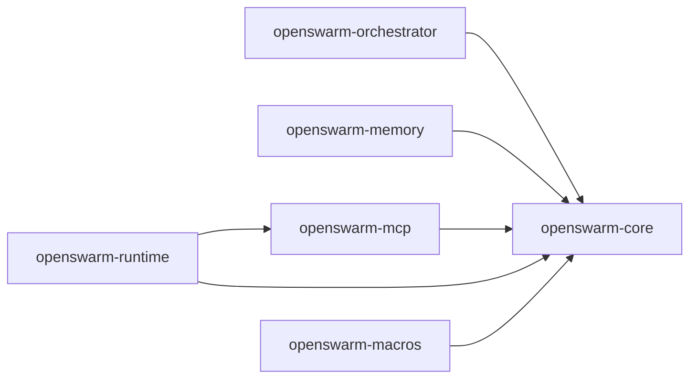

# How This Codebase Works (High Level)

This document explains the **rust-agent-framework** (OpenSwarm) in one place: what each crate does, how they connect, and how the main flows work.

---

## 1. The Big Picture

The framework is a **Rust workspace** of six crates. **openswarm-core** is the center: it defines the agent loop (ReAct), traits for tools and models, durable execution, evaluators, and the supervisor. The other crates depend on core and add orchestration, memory, MCP, WASM/runtime, and procedural macros.

- **core** — No internal crate deps. Agents, tools, models, ReAct loop, durable context, Router, Scorers, SPL, RunMetrics, built-in tools.
- **orchestrator** — Graph-based workflows (DAG or cycles): build graph, run with FlowRunner, tasks return NextAction.
- **memory** — Three-tier memory design; only Tier 1 (Episodic) is implemented (in-memory FIFO, time-travel helpers).
- **mcp** — Model Context Protocol: client (stdio/HTTP/channel), McpToolExecutor (bridges MCP tools to ReActAgent), server (expose Rust tools as MCP).
- **runtime** — WASM sandbox (Wasmtime), fuel/memory limits, optional MCP bridge and Rhai scripting.
- **macros** — `#[tool]` (schema + examples), `#[workflow]` (validates `DurableContext` first param).

---

## 2. How an Agent Run Works (ReAct)

The main agent pattern is **ReAct**: Thought → Action (tool call) → Observation → repeat until the model returns a final answer or hits an iteration cap.

1. You create a **ReActAgent** with: `AgentConfig`, a **ModelProvider** (OpenAI, Anthropic, Gemini), and a **ToolExecutor** (local registry and/or **McpToolExecutor**).
2. You call **run_agent(agent, user_input)** (or **run_agent_with_metrics** for SPL/observability).
3. The runner builds an **AgentContext** (message history), then loops:
   - **agent.step(ctx)** → model receives messages + tool definitions, returns either **ToolUse** blocks or **EndTurn** (final answer).
   - If tool use: runner calls **ToolExecutor::execute(name, id, args)**, appends tool results to `ctx.messages`, and steps again.
   - If final answer: loop exits and returns the reply.

**RunMetrics** (from `run_agent_with_metrics`) expose **iterations** and **tool_call_count** so you can compute SPL (Success weighted by Path Length) and other evals.

- **Router** (supervisor): optional trait to classify input into Route (Tier1/Tier2/Tier3) so you can pick a cheaper or more capable model. Stub: **AlwaysTier1**.
- **extract_xml_blocks(text, tag)** in core parses `<tag>…</tag>` (e.g. `<thinking>`) from assistant text for chain-of-thought or observability.

---

## 3. Tools and MCP

- **Tool** (core): single tool with `definition()` and `execute(arguments)`.
- **ToolExecutor** (core): registry with `tool_definitions()` and `execute(name, id, args)`; used by ReActAgent.
- **LocalToolRegistry** holds boxed `Tool`s; built-in tools include **TimeTool**, **ReadFileTool**, **SearchTool** (stub).
- **McpToolExecutor** (mcp crate): implements **ToolExecutor** by calling an **McpClient**. You `initialize()` the client, then `refresh_tools()` so the agent sees the server’s tools; each agent tool call becomes a **call_tool** JSON-RPC to the MCP server.
- **McpServer** does the reverse: takes a **ToolExecutor** and serves it over stdio/channel (and optionally HTTP) so external clients (e.g. IDEs) can call your Rust tools.

Transports: **Stdio** (spawn subprocess), **Http**, **Channel** (in-process tests). Context rot is mitigated by clear, action-oriented tool/resource descriptions.

---

## 4. Durable Execution (Workflows)

Durable workflows are **log-centric replay**: every non-deterministic step (tool call, sleep, timestamp, custom) is recorded in a **JournalBackend**. On restart, the workflow function is re-run from the beginning; when it hits a logged step, the journal returns the cached result instead of re-executing.

- **DurableContext** (core): `call_tool`, `sleep`, `timestamp`, `run_once(label, op)`, `resume()`. Used by workflow steps.
- **JournalBackend**: in-memory (tests) or file NDJSON (dev). Entries have seq, kind (ToolCall/Sleep/Timestamp/Custom), result, timestamps.
- **#[workflow]** (macros): validates that the first parameter is `Arc<DurableContext>` (or equivalent). No codegen; checkpointing is via the journal used by `DurableContext`.

---

## 5. Orchestrator (Graph Workflows)

**openswarm-orchestrator** runs **graph-based** workflows: you build an **ExecutionGraph** with **GraphBuilder** (add nodes, edges, conditional edges, start node), then run it with **FlowRunner**.

- **Task**: async trait with `State`, `run(key, state) -> (State, NextAction)`, `name()`.
- **NextAction**: **Continue** (follow graph edges), **Parallelize(node_keys)**, **WaitForInput(prompt)** (checkpoint and pause), **End**.
- Runner maintains a **ready queue** (nodes with no unsatisfied predecessors). Each round it runs all ready nodes in parallel, merges their output state (e.g. JSON merge), then applies **NextAction** to update predecessor counts and enqueue new nodes. Cycles are allowed (with a per-node iteration limit).
- **RunResult** contains state, **RunStatus** (Completed or WaitingForInput), and an optional **GraphCheckpoint** for **resume()** after human input.

Tasks can use **DurableContext** inside their run (e.g. call_tool, sleep) so graph nodes are durable as well.

---

## 6. Memory

**openswarm-memory** defines a **Memory** trait (store, recent, search, delete) and **MemoryEntry** (id, content, created_at, heat, optional embedding). Target design is three tiers (Episodic → Mid-term → Semantic); only **EpisodicMemory** exists today.

- **EpisodicMemory**: in-memory `VecDeque`, FIFO, max capacity; substring search. **Time-travel**: `entries_before(id)` and `recent_ordered(limit)` for ordered access.
- Use as `dyn Memory` where the app or agent needs a memory backend; Tier 2/3 will plug in later (disk summaries, vector store).

---

## 7. Runtime (WASM and Scripting)

**openswarm-runtime** provides a **Wasmtime** sandbox: **SandboxConfig** (max memory, max fuel, **allow_mcp**), **compile(wasm_bytes)** or **load_aot**, then **run_compiled(module, params)**. Each call gets a fresh **Store**, resource limiter, and fuel; linker is WASI preview1 with an empty context by default. If **allow_mcp** is true, a bridge can expose host MCP tools to the guest.

- WASM modules export **memory**, **alloc**, **run_json(ptr, len)**. Host passes JSON in/out via guest memory; result is `(result_ptr << 32) | result_len` or -1 on error.
- Optional **Rhai** scripting (feature) for in-process, gas-metered scripting.

---

## 8. Evaluators and SPL

In **core**:

- **Scorer**: async trait `score(&self, input: &ScoreInput) -> Result<ScoreResult>` (score in [0,1] + reason). **ScoreInput** has messages, final_answer, optional expected.
- **batch_score(scorer, inputs)** runs a scorer on many cases (e.g. CI).
- **NonEmptyScorer** / **ContainsScorer**: simple deterministic scorers; ContainsScorer uses **expected** (substring, case-insensitive).
- **BenchmarkTask**: optional **expected** and **optimal_path_length** (L_opt). **SplRun**: score, path_length (L_exec), L_opt. **spl(runs)** = (1/N) × Σ (S_i × L_opt / max(L_exec, L_opt)) — Success weighted by Path Length; **RunMetrics.tool_call_count** supplies L_exec.

---

## 9. Config, Messages, and Providers

- **AgentConfig**: name, **ModelConfig** (model_id, temperature, max_tokens), system_prompt, max_iterations, chain-of-thought.
- **Message**: role (System/User/Assistant) + **Vec&lt;ContentBlock&gt;** (text, tool_use, tool_result). **CompletionRequest** / **CompletionResponse** are the provider API surface.
- **ModelProvider**: `complete(Request) -> Result<CompletionResponse>`, optional streaming. Implementations: **OpenAI**, **Anthropic**, **Gemini** (credentials via env / **ProviderCredentials**).
- **FrameworkError** is the unified error type across crates.

---

## 10. How It All Fits Together

| You want to…                               | Use                                                                                                                                     |
| ------------------------------------------ | --------------------------------------------------------------------------------------------------------------------------------------- |
| Run a single agent with tools              | **ReActAgent** + **ToolExecutor** (LocalToolRegistry and/or **McpToolExecutor**) + **run_agent** / **run_agent_with_metrics**.          |
| Expose your tools to an IDE                | **McpServer** + your **ToolExecutor** + stdio/channel transport.                                                                        |
| Call external MCP tools from the agent     | **McpClient** (stdio/http/channel) → **McpToolExecutor** → pass as agent’s **ToolExecutor**; **initialize()** then **refresh_tools()**. |
| Run a DAG or cyclic workflow with state    | **GraphBuilder** → **ExecutionGraph** → **FlowRunner::run(initial_state)**; nodes implement **Task**, return **NextAction**.            |
| Durable workflow steps (tool/sleep replay) | **DurableContext** + **JournalBackend**; mark entrypoints with **#[workflow]** (first param `Arc<DurableContext>`).                     |
| Persist recent context for an agent        | **EpisodicMemory** (or other **Memory** impl); pass into your app layer.                                                                |
| Run untrusted tool logic in isolation      | **openswarm-runtime** **Sandbox** + WASM module (run_json convention); optionally **allow_mcp** for MCP bridge.                         |
| Define tools with schema + examples        | **#[tool]** (and **#[tool(example(...))]**) on async fns; register in **LocalToolRegistry** or expose via **McpServer**.                |
| Evaluate agent runs (SPL, batch)           | **run_agent_with_metrics**, **Scorer** impls, **batch_score**, **spl(runs)**; use **BenchmarkTask** for L_opt.                          |
| Route by difficulty (supervisor)           | **Router::route(input)** → **Route** (Tier1/2/3); choose model or agent accordingly (e.g. **AlwaysTier1** for tests).                   |

---

## 11. Where to Read More

- **documentation/architecture/** — Per-crate docs: [00-overview](architecture/00-overview.md), [01-core](architecture/01-core.md), [02-orchestrator](architecture/02-orchestrator.md), [03-memory](architecture/03-memory.md), [04-mcp](architecture/04-mcp.md), [05-runtime](architecture/05-runtime.md), [06-macros](architecture/06-macros.md), [07-observability-apm](architecture/07-observability-apm.md).
- **documentation/FRAMEWORK-BUILD-CHECKLIST.md** — Implementation checklist and section references.

This file is the single high-level explanation; the architecture folder fills in diagrams and details per crate.
