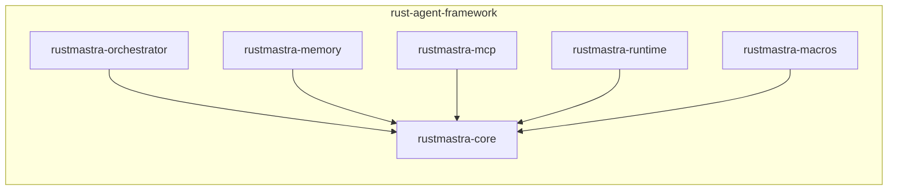
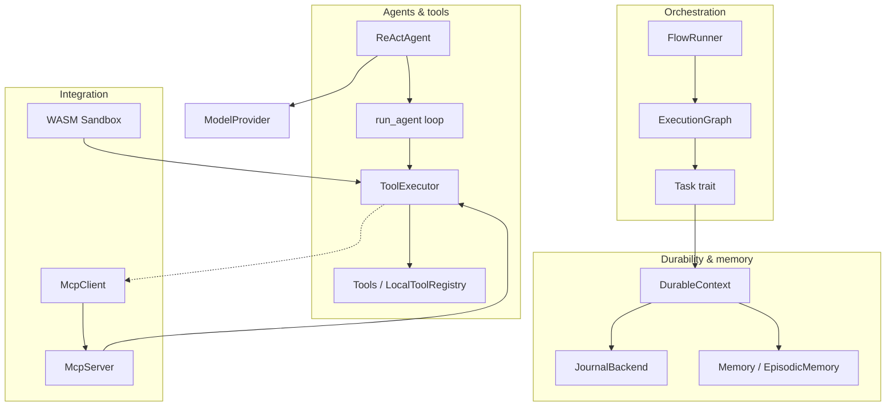

# Rust Agent Framework — Implementation Overview

This document and the others in `documentation/architecture/` describe **what is currently implemented** in the codebase, using Mermaid diagrams and short prose.

## Workspace and crates

The workspace has six member crates. Dependencies between them look like this:

- **core** — No internal crate dependencies. Defines traits, config, messages, model providers, ReAct loop, and durable execution.
- **orchestrator** — Depends on core. Graph-based workflow engine (petgraph + slotmap).
- **memory** — Depends on core. Three-tier memory trait and Tier 1 (episodic) stub.
- **mcp** — Depends on core. MCP client, server, and tool executor.
- **runtime** — Depends on core. WASM sandbox (Wasmtime) for tool isolation.
- **macros** — Depends on core. Procedural macros: `#[tool]`, `#[workflow]`.

## High-level architecture

## Document index

| File | Contents |
|------|----------|
| [00-overview.md](00-overview.md) | Workspace, crate graph, high-level architecture (this file) |
| [01-core.md](01-core.md) | Core: traits, config, messages, providers, ReAct, durable execution |
| [02-orchestrator.md](02-orchestrator.md) | Graph builder, ExecutionGraph, FlowRunner, Task, NextAction |
| [03-memory.md](03-memory.md) | Memory trait, EpisodicMemory (Tier 1 stub) |
| [04-mcp.md](04-mcp.md) | McpClient, McpServer, McpToolExecutor, transports |
| [05-runtime.md](05-runtime.md) | WASM sandbox, SandboxConfig, run_json protocol |
| [06-macros.md](06-macros.md) | `#[tool]` and `#[workflow]` macros |
