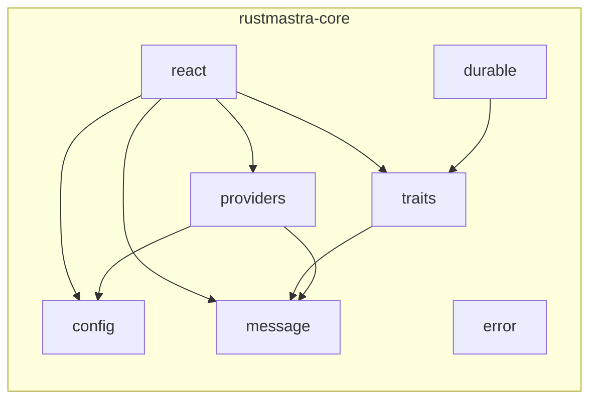
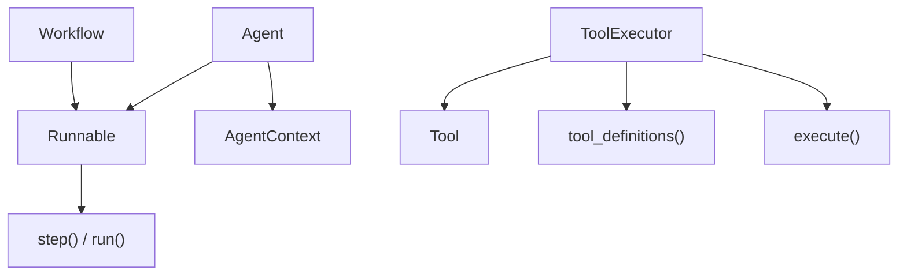
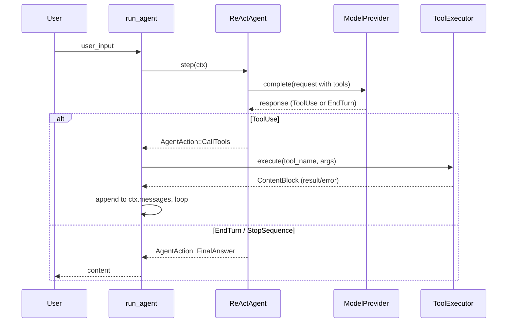
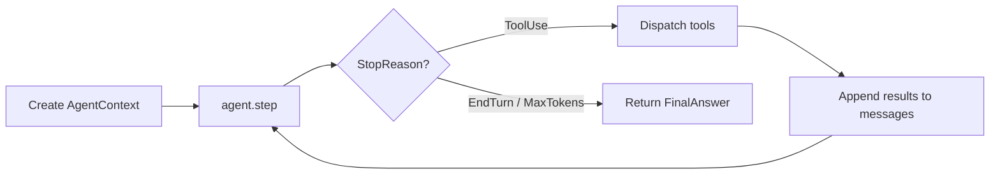
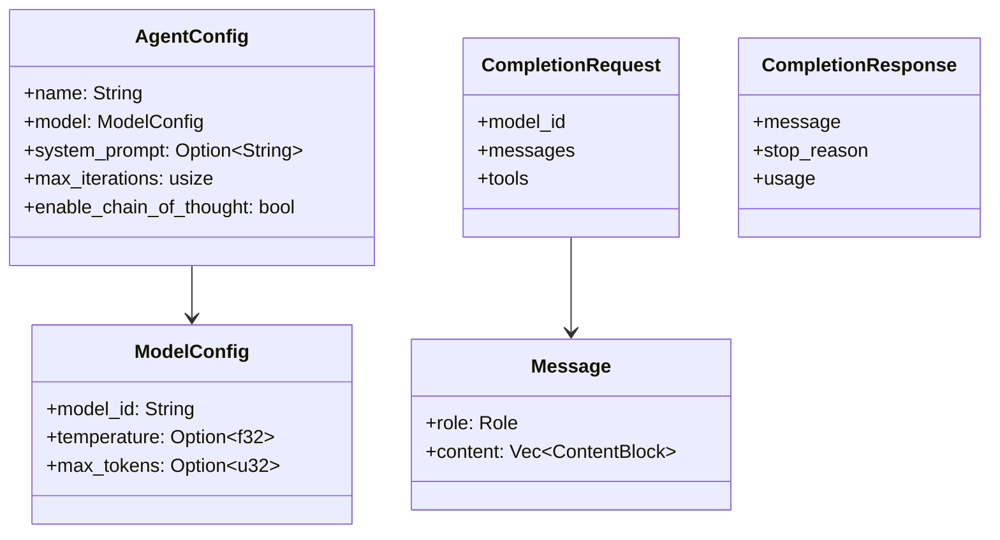
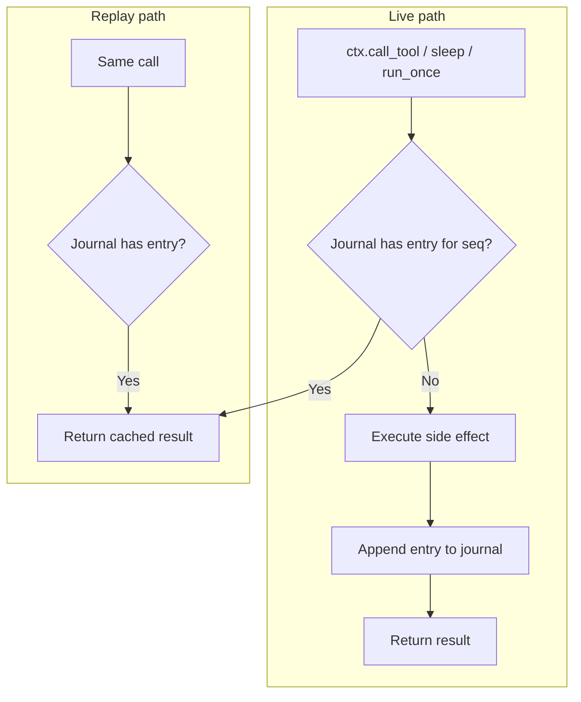
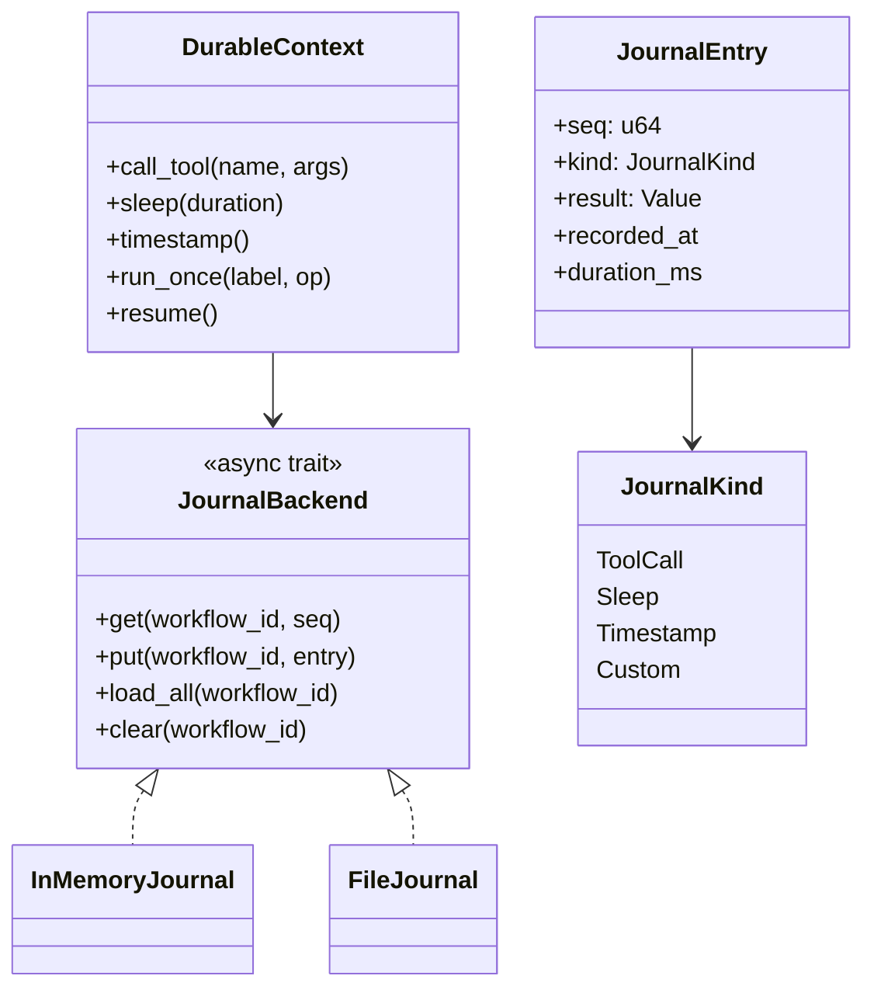

# Core crate (rustmastra-core)

The core crate provides traits, configuration, messages, model providers, the ReAct agent loop, and log-centric durable execution.

## Module layout



## Trait hierarchy



| Trait | Purpose | Used by |
|-------|---------|--------|
| `Runnable` | Base for runnable components | `Agent`, `Workflow` |
| `Agent` | Probabilistic, model-driven; maintains message history and calls LLM each step | `ReActAgent` |
| `Workflow` | Deterministic; steps are explicit | Orchestrator / durable workflows |
| `Tool` | Single tool: `definition()` + `execute(arguments)` | Boxed in `LocalToolRegistry` |
| `ToolExecutor` | Registry: `tool_definitions()` + `execute(name, id, args)` | `ReActAgent`, `McpServer` |

## ReAct loop

The ReAct pattern: **Thought → Action (tool call) → Observation → repeat** until final answer or iteration cap.





- **ReActAgent** owns: `AgentConfig`, `Arc<dyn ModelProvider>`, `Arc<dyn ToolExecutor>`.
- **run_agent(agent, user_input)** creates context, loops on `step()`, dispatches tool calls, returns final text.

## Config and messages



- **AgentConfig** — name, model config, system prompt, iteration cap, chain-of-thought flag.
- **Message** — role (System/User/Assistant) + content blocks (text, tool_use, tool_result).
- **CompletionRequest / CompletionResponse** — what providers consume and return; support streaming.

## Model providers

```mermaid
flowchart LR
    ModelProvider["ModelProvider trait"]
    OpenAI[OpenAiProvider]
    Anthropic[AnthropicProvider]
    Gemini[GeminiProvider]

    ModelProvider <|.. OpenAI
    ModelProvider <|.. Anthropic
    ModelProvider <|.. Gemini
```

- **ModelProvider**: `complete(Request) -> Result<CompletionResponse>`, optional streaming.
- Implementations: **OpenAI**, **Anthropic**, **Gemini**; credentials via env / `ProviderCredentials`.

## Durable execution (log-centric replay)

Durable workflows use a **journal**: every non-deterministic operation is logged; on restart the workflow is re-run from the start and the journal replays cached results.





- **JournalBackend** — storage for entries (in-memory for tests, file NDJSON for local dev).
- **JournalEntry** — seq, kind (ToolCall / Sleep / Timestamp / Custom), result, timestamps.
- **DurableContext** — built over a backend; on each `call_tool` / `sleep` / `run_once` checks journal first (replay) or runs and appends (live). `resume()` used for recovery.

## Error type

- **FrameworkError** — unified error enum (provider, tool execution, serialization, durable, WASM, etc.).
- **Result&lt;T&gt;** = `Result<T, FrameworkError>`.
