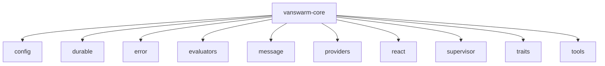
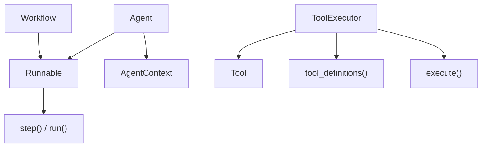
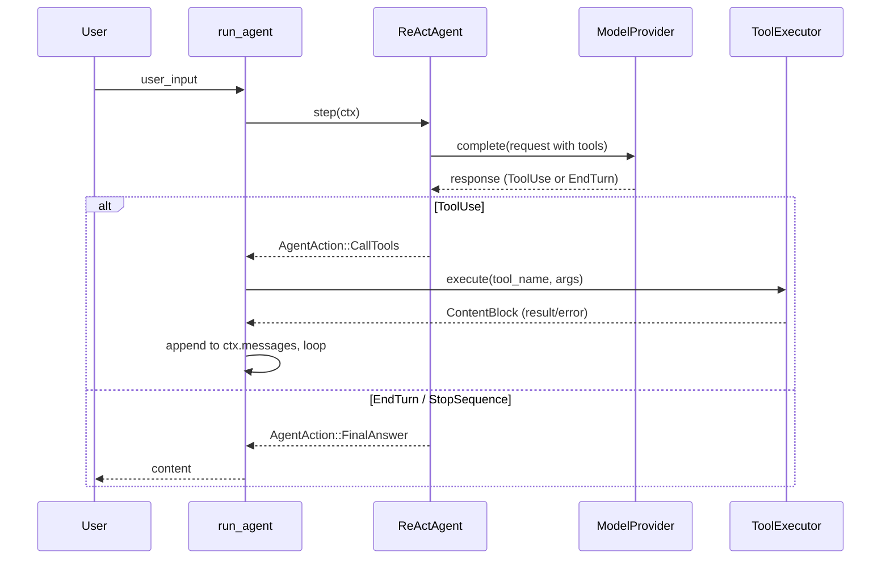
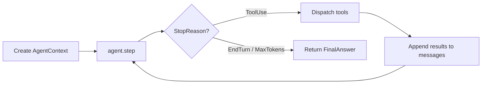
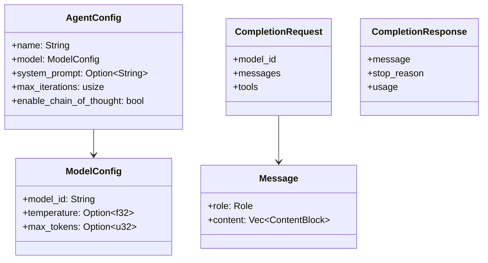
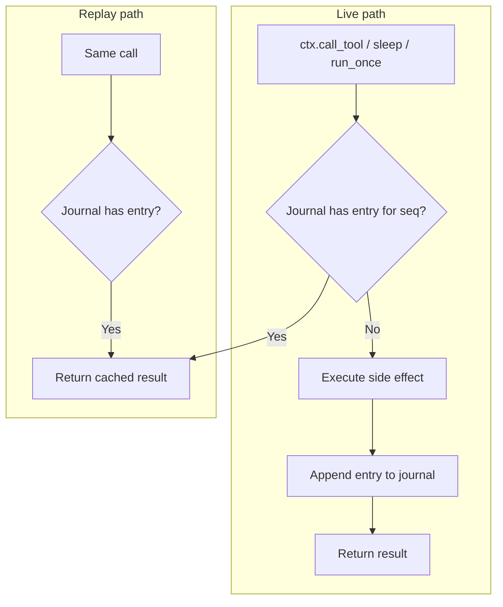
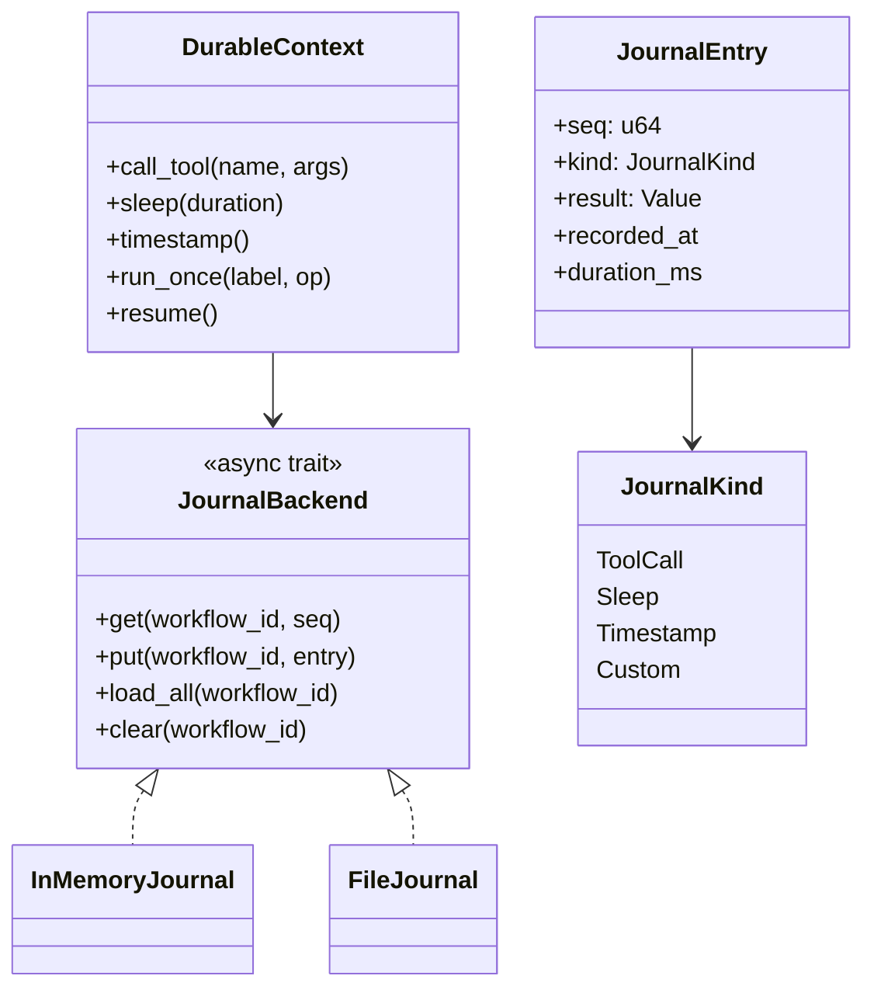
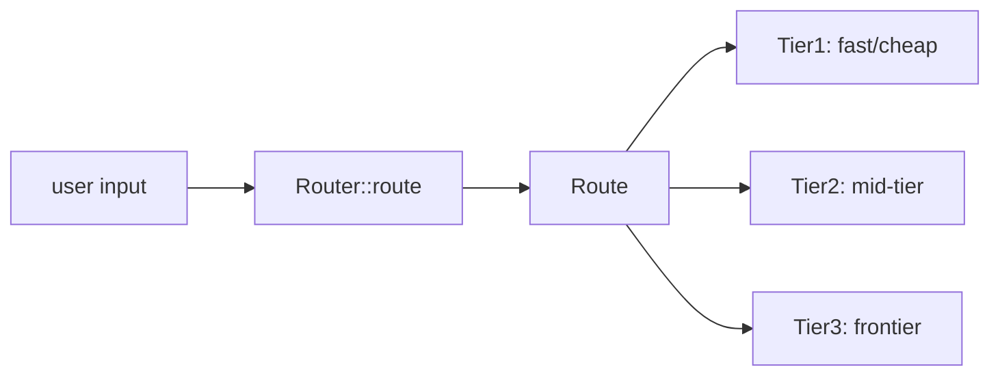

# Core crate (vanswarm-core)

The core crate provides traits, configuration, messages, model providers, the ReAct agent loop, log-centric durable execution, **supervisor** (Router / Route), **evaluators** (Scorer, SPL, batch evals), and **tools** (built-in tools).

## Module layout



- **evaluators** — Scorer trait, ScoreInput/ScoreResult, batch_score, SPL (SplRun, spl), BenchmarkTask, NonEmptyScorer, ContainsScorer.
- **supervisor** — Router trait, Route (Tier1/Tier2/Tier3), AlwaysTier1 stub.
- **tools** — Built-in tools: TimeTool, ReadFileTool, SearchTool.

## Trait hierarchy



| Trait          | Purpose                                                                        | Used by                          |
| -------------- | ------------------------------------------------------------------------------ | -------------------------------- |
| `Runnable`     | Base for runnable components                                                   | `Agent`, `Workflow`              |
| `Agent`        | Probabilistic, model-driven; maintains message history and calls LLM each step | `ReActAgent`                     |
| `Workflow`     | Deterministic; steps are explicit                                              | Orchestrator / durable workflows |
| `Tool`         | Single tool: `definition()` + `execute(arguments)`                             | Boxed in `LocalToolRegistry`     |
| `ToolExecutor` | Registry: `tool_definitions()` + `execute(name, id, args)`                     | `ReActAgent`, `McpServer`        |

## ReAct loop

The ReAct pattern: **Thought → Action (tool call) → Observation → repeat** until final answer or iteration cap.





- **ReActAgent** owns: `AgentConfig`, `Arc<dyn ModelProvider>`, `Arc<dyn ToolExecutor>`.
- **run_agent(agent, user_input)** creates context, loops on `step()`, dispatches tool calls, returns final text.
- **run_agent_with_metrics(agent, user_input)** returns `(String, RunMetrics)`; **RunMetrics** has `iterations` and `tool_call_count` (path length for SPL). **AgentContext** tracks `tool_call_count` per run.
- **extract_xml_blocks(text, tag)** parses `<tag>…</tag>` from assistant text (e.g. `<thinking>` for chain-of-thought).

## Config and messages



- **AgentConfig** — name, model config, system prompt, iteration cap, chain-of-thought flag.
- **Message** — role (System/User/Assistant) + content blocks (text, tool_use, tool_result).
- **CompletionRequest / CompletionResponse** — what providers consume and return; support streaming.

## Model providers

```mermaid
flowchart LR
    ModelProvider["ModelProvider trait"]
    OpenAI[OpenAiProvider]
    Anthropic[AnthropicProvider]
    Gemini[GeminiProvider]

    ModelProvider <|.. OpenAI
    ModelProvider <|.. Anthropic
    ModelProvider <|.. Gemini
```

- **ModelProvider**: `complete(Request) -> Result<CompletionResponse>`, optional streaming.
- Implementations: **OpenAI**, **Anthropic**, **Gemini**; credentials via env / `ProviderCredentials`.

## Durable execution (log-centric replay)

Durable workflows use a **journal**: every non-deterministic operation is logged; on restart the workflow is re-run from the start and the journal replays cached results.





- **JournalBackend** — storage for entries (in-memory for tests, file NDJSON for local dev).
- **JournalEntry** — seq, kind (ToolCall / Sleep / Timestamp / Custom), result, timestamps.
- **DurableContext** — built over a backend; on each `call_tool` / `sleep` / `run_once` checks journal first (replay) or runs and appends (live). `resume()` used for recovery.

## Supervisor / Router (§11.1)

The **Router** trait classifies input and returns a **Route** so the caller can select the right model or agent (SupervisorAgent pattern).



| Type          | Purpose                                                       |
| ------------- | ------------------------------------------------------------- |
| `Route`       | Enum: `Tier1`, `Tier2`, `Tier3` (§11.2–11.4).                 |
| `Router`      | Async trait: `route(&self, input: &str) -> Result<Route>`.    |
| `AlwaysTier1` | Stub impl that always returns `Tier1` (tests / single-model). |

## Evaluators and SPL (§12, §11.6–11.7)

- **Scorer** — Async trait: `name()`, `score(&self, input: &ScoreInput) -> Result<ScoreResult>`. Score in [0, 1] and reason string.
- **ScoreInput** — `messages`, `final_answer`, optional `expected` (for supervised evals).
- **ScoreResult** — `score: f64`, `reason: String`.
- **batch_score(scorer, inputs)** — Run scorer on N test cases for CI (§12.10).
- **NonEmptyScorer** / **ContainsScorer** — Deterministic scorers (§12.2). ContainsScorer uses `ScoreInput::expected` (substring, case-insensitive by default).
- **BenchmarkTask** — Optional `expected` and **optimal_path_length** (L_opt) for benchmark tasks (§11.7).
- **SplRun** — One run for SPL: `score`, `path_length` (L_exec), `optimal_path_length` (L_opt).
- **spl(runs)** — Success weighted by Path Length: (1/N) × Σ (S_i × L_opt / max(L_exec, L_opt)) (§11.6).

## Built-in tools (§10.11)

- **TimeTool** — No params; returns current UTC (ISO 8601).
- **ReadFileTool::new(root)** — Param `path` (relative to root); path traversal rejected.
- **SearchTool** — Stub; param `query`; returns a message that search is a stub (use MCP or custom backend in production).

## Error type

- **FrameworkError** — unified error enum (provider, tool execution, serialization, durable, WASM, etc.).
- **Result&lt;T&gt;** = `Result<T, FrameworkError>`.
