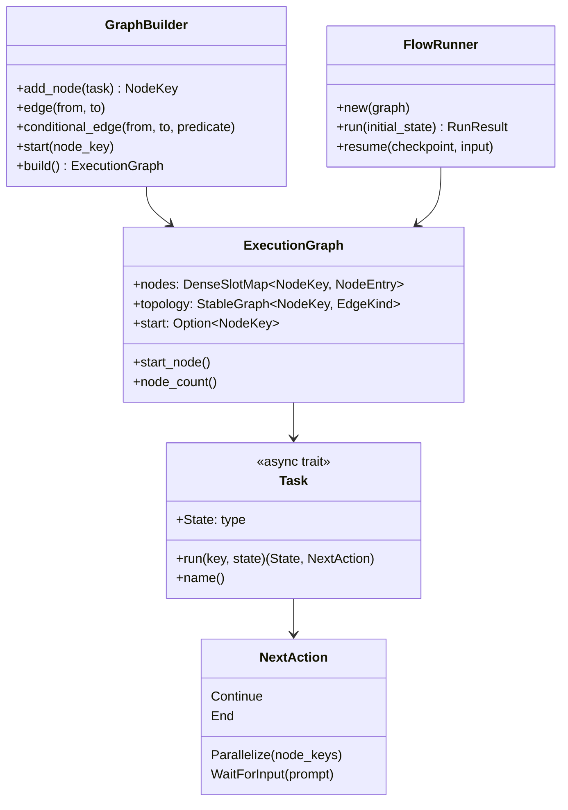
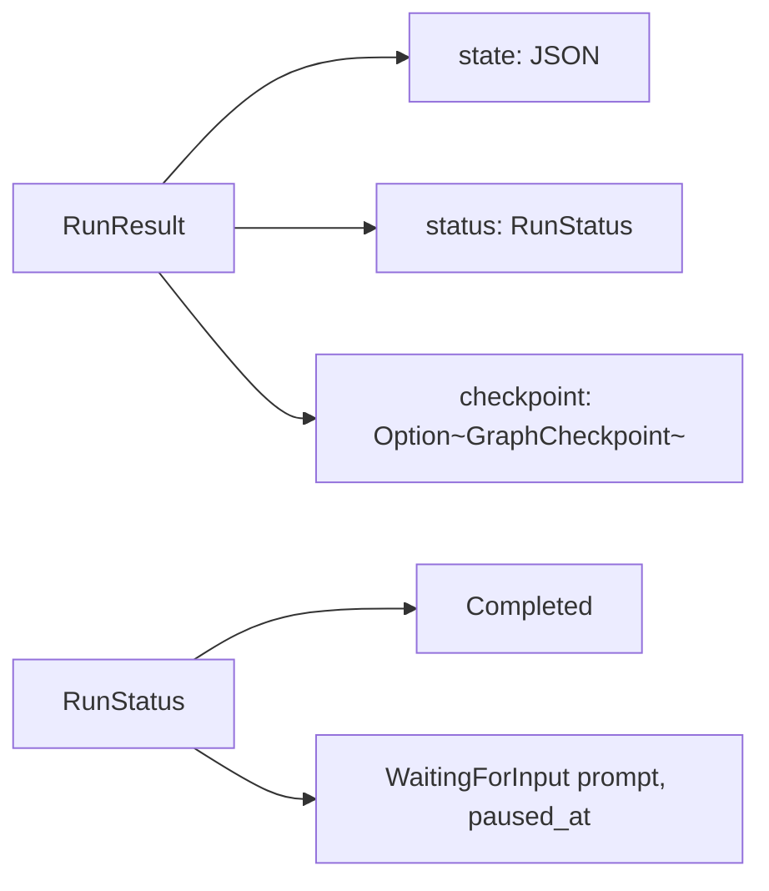
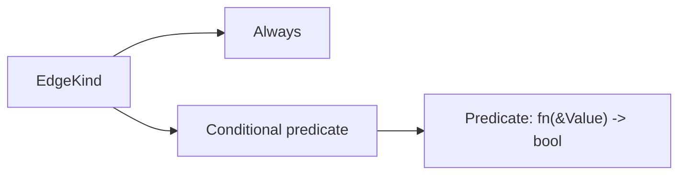
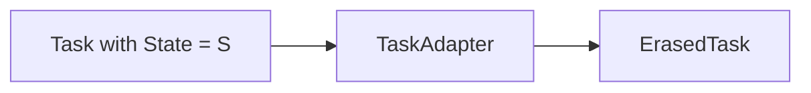

# Orchestrator crate (rustmastra-orchestrator)

Graph-based workflow orchestration: build a DAG (or graph with cycles), then execute it with a single runner that schedules nodes and merges state.

## Crate structure

```mermaid
flowchart LR
    subgraph orchestrator["rustmastra-orchestrator"]
        graph[graph.rs]
        runner[runner.rs]
        task[task.rs]
    end

    runner --> graph
    runner --> task
    graph --> task
```

## Key types



- **NodeKey** — generational key (slotmap) for a node; stable across graph edits.
- **Task** — async trait: `State` type, `run(key, state) -> (State, NextAction)`, `name()`.
- **NextAction** — what the runner does after the node: follow edges (`Continue`), schedule specific nodes (`Parallelize`), pause for human input (`WaitForInput`), or stop (`End`).
- **ExecutionGraph** — immutable: slotmap of type-erased tasks + petgraph topology (edges carry `EdgeKind`: Always or Conditional predicate).
- **GraphBuilder** — fluent API to add nodes, edges, conditional edges, set start, then `build()`.
- **FlowRunner** — executes from start; manages ready queue and predecessor counts; returns `RunResult` (state + status + optional checkpoint).

## Execution flow

```mermaid
flowchart TB
    subgraph init["Initialization"]
        A[FlowRunner::run(initial_state)]
        B[Mark start node ready]
        C[Initialize pending_preds for all nodes]
    end

    subgraph round["Per round"]
        D[Drain ready queue]
        E[Spawn all ready nodes in parallel]
        F[Wait for all to complete]
        G[JSON-merge output states]
        H[For each node: apply NextAction]
    end

    subgraph next["Next actions"]
        I[Continue: decrement successor pending_preds]
        J[Parallelize: push nodes to ready]
        K[WaitForInput: checkpoint, return]
        L[End: do not follow successors]
    end

    A --> B --> C --> D
    D --> E --> F --> G --> H
    H --> I
    H --> J
    H --> K
    H --> L
    I --> D
    J --> D
    L --> D
```

1. **Ready queue** — nodes whose predecessor count has reached 0.
2. **Each round** — run all currently ready nodes in parallel (e.g. via `JoinSet`).
3. **State** — each node receives current accumulated state and returns updated state; runner merges (e.g. JSON merge, right-wins).
4. **NextAction** — determines which nodes become ready next or whether to pause/end.
5. **Cycles** — supported: when a `Continue` edge points to an already-completed node, it can be re-queued; a per-node cycle counter limits iterations.

## Run result and checkpoint



- **RunStatus** — `Completed` or `WaitingForInput { prompt, paused_at }`.
- **GraphCheckpoint** — serializable snapshot (state, prompt, paused_at, completed set, ready queue, pending_preds, visit counts, total steps). Persist and pass to `FlowRunner::resume()` to continue after human input.

## Edge kinds



- **Always** — edge is followed after the node completes (subject to NextAction).
- **Conditional(Predicate)** — edge is followed only if the predicate returns true for the current accumulated JSON state.

## Task type erasure



- **ErasedTask** — type-erased task so the graph can hold different `Task` implementations with different `State` types. State is serialized to `serde_json::Value` between nodes; each node receives deserialized state for its type.
- **TaskAdapter** — wraps a concrete `Task<S>` and implements `ErasedTask` (serialize/deserialize at boundary).
