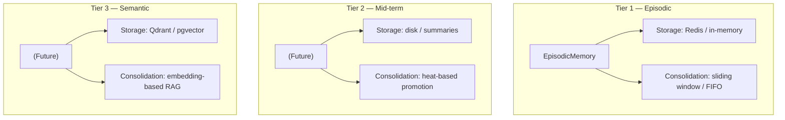
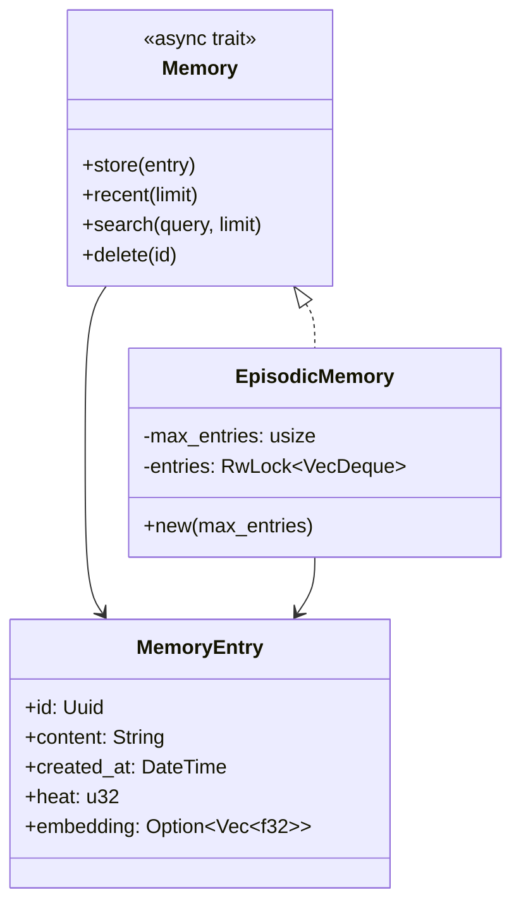

# Memory crate (vanswarm-memory)

Three-tier cognitive memory subsystem. Currently only **Tier 1 (Episodic)** is implemented as an in-process stub.

## Tier overview (target design)



| Tier | Name     | Storage (target)  | Consolidation (target) |
| ---- | -------- | ----------------- | ---------------------- |
| 1    | Episodic | Redis / in-memory | Sliding window / FIFO  |
| 2    | Mid-term | Disk / summaries  | Heat-based promotion   |
| 3    | Semantic | Qdrant / pgvector | Embedding-based RAG    |

## Implemented: Memory trait and EpisodicMemory



- **Memory** — common interface for all tiers: store, recent, search, delete. Allows swapping backends (e.g. in-memory for dev, Redis for production).
- **MemoryEntry** — id, content, created_at, heat (retrieval count for future heat-based promotion), optional embedding (for Tier 3).
- **EpisodicMemory** — in-memory `VecDeque`: FIFO, max capacity; when full, oldest entry is dropped. Search is simple substring match (full-text/semantic reserved for future tiers). **Time-travel** (§8.3): `entries_before(id)` returns entries in order as they were before the given entry; `recent_ordered(limit)` returns the most recent `limit` entries in chronological order (oldest first).

## Usage (conceptual)

```mermaid
flowchart LR
    App[Application / Agent]
    Memory[Memory trait]
    Episodic[EpisodicMemory]

    App --> Memory
    Memory <|.. Episodic
```

- Depend on `vanswarm-memory`; construct `EpisodicMemory::new(max_entries)` and use it as `dyn Memory` where the three-tier design will later plug in Tier 2 and Tier 3 implementations.
