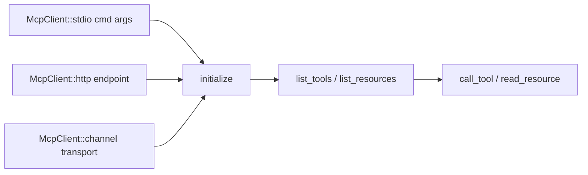
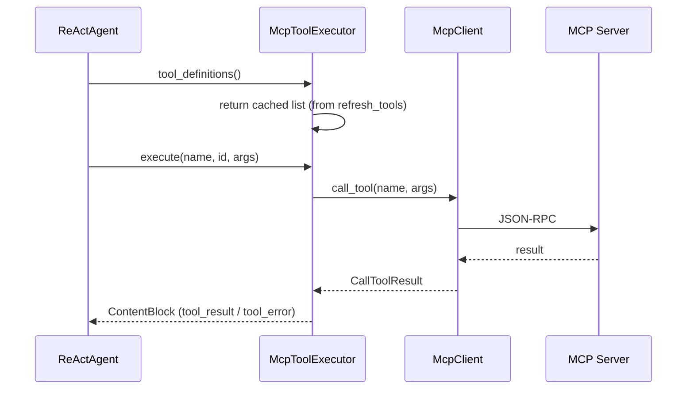
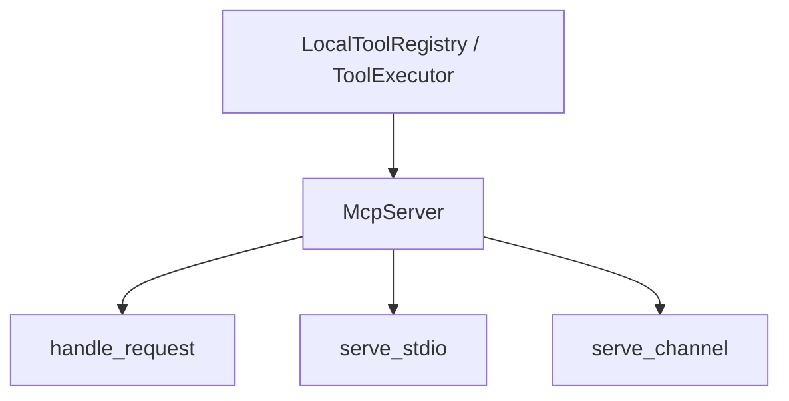
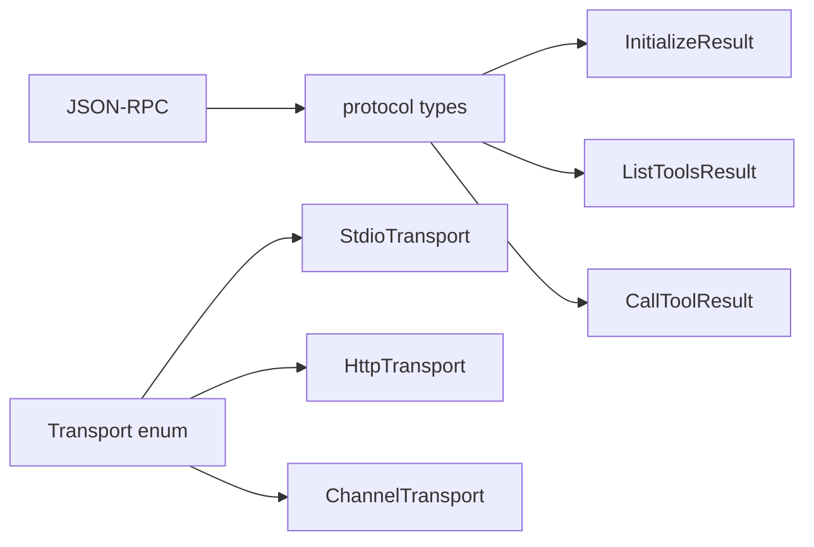

# MCP crate (rustmastra-mcp)

Model Context Protocol client and server: connect agents to external MCP servers (e.g. filesystem, fetch) and expose RustMastra tools as an MCP server.

## Components

```mermaid
flowchart TB
    subgraph client_side["Client side"]
        McpClient[McpClient]
        McpToolExecutor[McpToolExecutor]
        Transport[Transport]
    end

    subgraph server_side["Server side"]
        McpServer[McpServer]
        ToolExecutor[ToolExecutor]
    end

    subgraph transports["Transports"]
        Stdio[StdioTransport]
        Http[HttpTransport]
        Channel[ChannelTransport]
    end

    McpClient --> Transport
    Transport --> Stdio
    Transport --> Http
    Transport --> Channel

    McpToolExecutor --> McpClient
    McpToolExecutor ..> ToolExecutor

    McpServer --> ToolExecutor
    McpServer --> Channel
```

## McpClient



- **Constructors**: `stdio(command, args)` — spawn subprocess; `http(endpoint)` — HTTP; `channel(ChannelTransport)` — in-memory for tests.
- **Protocol**: Call `initialize()` before any tools/resources; then `list_tools()`, `call_tool(name, arguments)`, and optional resource APIs.

## McpToolExecutor (bridge to ReActAgent)



- **McpToolExecutor** implements core’s **ToolExecutor**: `tool_definitions()` returns cached MCP tool schemas; `execute()` forwards to `McpClient::call_tool()` and maps result to `ContentBlock`.
- **refresh_tools()** must be called after `client.initialize()` so the agent sees the server’s tools.

## McpServer (expose tools as MCP)



- **McpServer::new(name, version, executor)** — any `Arc<dyn ToolExecutor>` (e.g. `LocalToolRegistry`).
- **serve_stdio()** — blocks on stdin/stdout (IDE / Claude Desktop).
- **serve_channel()** — returns a transport and handle for in-process tests.
- **add_resource()** — register static resources (name, content provider).

## Protocol and transport



- **protocol** — MCP types: `InitializeResult`, `ListToolsResult`, `McpTool`, `CallToolResult`, resources, etc.
- **jsonrpc** — parse/serialize JSON-RPC requests and responses.
- **transport** — abstraction over stdio, HTTP, or in-memory channel so client and server can be tested without subprocesses.
