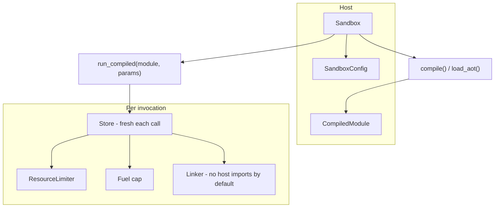
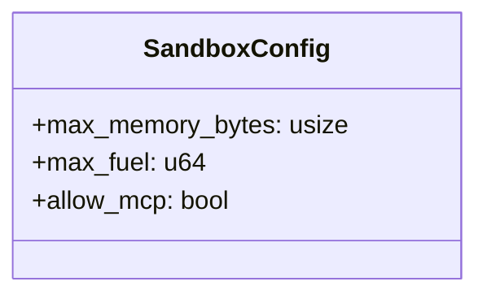
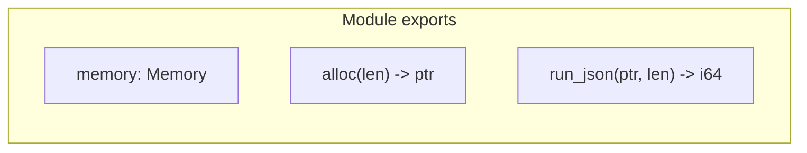

# Runtime crate (rustmastra-runtime)

Wasmtime-based WASM sandbox for secure, isolated tool execution. Each invocation gets a fresh Store; fuel and memory are capped.

## Sandbox model



- **Sandbox** — holds engine and config; `compile(wasm_bytes)` or `load_aot(aot_bytes)` produces a **CompiledModule** (cheap to clone).
- **run_compiled(module, params)** — for each call: new Store, attach resource limiter and fuel, linker with WASI preview1 in **empty context** (§5.3), instantiate, call `run_json`.

## SandboxConfig



| Field | Purpose |
|-------|---------|
| `max_memory_bytes` | Cap on linear memory (e.g. 5 MiB). |
| `max_fuel` | Instruction fuel; exhaustion traps (stops runaway loops). |
| `allow_mcp` | When true, linker may expose MCP bridge so sandboxed WASM can call host MCP tools; default false = no host imports. See also [04-wasm-mcp-bridge](../../framework/workflows/04-wasm-mcp-bridge.md). |

## run_json calling convention

WASM modules that participate in the framework must export:



| Export | Signature | Description |
|--------|------------|-------------|
| `memory` | `Memory` | Guest linear memory |
| `alloc` | `(i32) -> i32` | Allocate `len` bytes; return guest pointer |
| `run_json` | `(i32, i32) -> i64` | Input JSON at `(ptr, len)`; return `(result_ptr << 32) \| result_len`, or `-1` on error |

Host writes params JSON into guest memory via `alloc` + memory write; calls `run_json`; reads result from guest memory and deserializes JSON.

## Execution path


- Execution runs inside `tokio::task::spawn_blocking` so the async runtime is not blocked by WASM.
- **ResourceLimiter** — `memory_growing` enforces `max_memory_bytes`; table growth can be allowed.
- **Fuel** — set once per Store; when exhausted, `run_json` traps and the host gets an error.

## AOT (ahead-of-time) compilation

```mermaid
flowchart LR
    A[compile(wasm_bytes)]
    B[CompiledModule]
    C[serialize_aot]
    D[aot_bytes]
    E[load_aot]
    F[CompiledModule]

    A --> B
    B --> C
    C --> D
    D --> E
    E --> F
```

- **serialize_aot(module)** — engine-specific bytes; store to disk for fast subsequent load.
- **load_aot(aot_bytes)** — unsafe: bytes must come from the same engine config; yields a `CompiledModule` without re-parsing WASM.
- **Sub-millisecond tool invocation (§5.7):** Use AOT for hot path: `load_aot` + `run_compiled` avoids JIT; target is sub-ms for the invocation itself after load.

## Security model (§5.12)

By default the guest has **no host capabilities**:

- **No host filesystem** — no preopens, no directory access.
- **No arbitrary network** — no sockets, no DNS.
- **No environment variables or arguments** — WasiCtxBuilder is configured empty (§5.3).
- **No stdio** — stdin closed; stdout/stderr discard.

The linker exposes WASI preview1 with an **empty** [WasiCtxBuilder] (null/empty); only explicitly added capabilities (e.g. MCP bridge when `allow_mcp` is true, §6) are available. This achieves a zero-trust default: the agent cannot perform host I/O unless the embedder adds it.

[WasiCtxBuilder]: https://docs.rs/wasmtime-wasi/latest/wasmtime_wasi/struct.WasiCtxBuilder.html

## Cold start (§5.8)

Target: **&lt;10 ms** for a single WASM tool call (framework goal). Measure with the `cold_start` benchmark:

- **Cold (compile + run):** first-time `compile(wasm_bytes)` then `run_compiled` — includes JIT.
- **AOT (load + run):** `load_aot(aot_bytes)` then `run_compiled` — no JIT; typically sub-ms after load.

Run: `cargo bench -p rustmastra-runtime --features wasm`.

## Guest/host contract and WIT (§5.11, §6.1)

The current **guest/host contract** is the `run_json` convention (see crate root): the guest exports `memory`, `alloc`, and `run_json(ptr, len) -> i64`. The host does not use the Component Model yet; it uses core modules and a raw linker.

**WIT (Wasm Interface Type)** will formalise the guest/host contract when the WASM-to-MCP bridge is implemented (§6). The intended interface is defined in `crates/runtime/wit/mcp.wit`:

- **`rustmastra:runtime/mcp`** — interface that the guest can import when `allow_mcp` is true.
- **`call-tool(name-ptr, name-len, params-ptr, params-len)`** — returns `result<(ptr, len), string>` so the guest can invoke MCP tools via the host.

**§6 implemented:** With the `mcp-bridge` feature and `SandboxConfig::mcp_client` set, the host binds `mcp/call_tool` to the given [`McpClient`]. The guest passes (name_ptr, name_len, params_ptr, params_len); the host reads name/params from linear memory, calls the MCP client, writes the result JSON via the guest’s `alloc`, and returns (ptr|len). The sandboxed agent can only invoke tools exposed by that MCP server (§6.9). See test `test_guest_calls_mcp_tool_via_bridge`.
