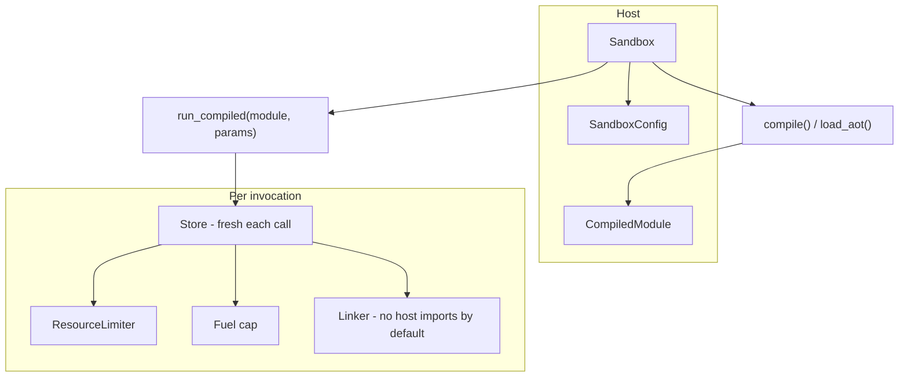
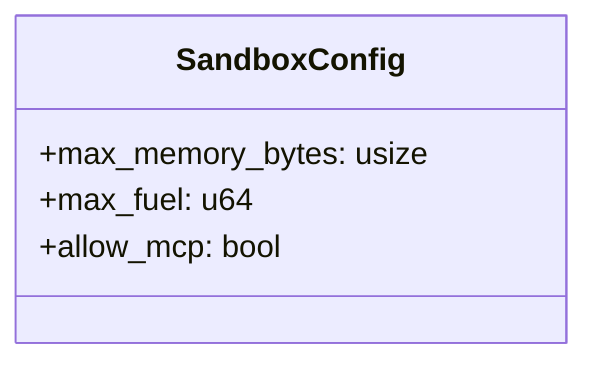
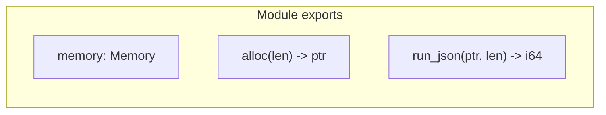
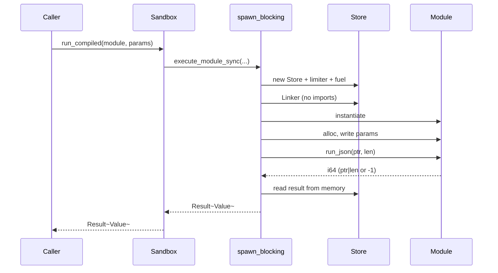

# Runtime crate (rustmastra-runtime)

Wasmtime-based WASM sandbox for secure, isolated tool execution. Each invocation gets a fresh Store; fuel and memory are capped.

## Sandbox model



- **Sandbox** — holds engine and config; `compile(wasm_bytes)` or `load_aot(aot_bytes)` produces a **CompiledModule** (cheap to clone).
- **run_compiled(module, params)** — for each call: new Store, attach resource limiter and fuel, linker with no host imports (unless `allow_mcp`), instantiate, call `run_json`.

## SandboxConfig



| Field | Purpose |
|-------|---------|
| `max_memory_bytes` | Cap on linear memory (e.g. 5 MiB). |
| `max_fuel` | Instruction fuel; exhaustion traps (stops runaway loops). |
| `allow_mcp` | When true, linker may expose MCP bridge (future); default false = no host imports. |

## run_json calling convention

WASM modules that participate in the framework must export:



| Export | Signature | Description |
|--------|------------|-------------|
| `memory` | `Memory` | Guest linear memory |
| `alloc` | `(i32) -> i32` | Allocate `len` bytes; return guest pointer |
| `run_json` | `(i32, i32) -> i64` | Input JSON at `(ptr, len)`; return `(result_ptr << 32) \| result_len`, or `-1` on error |

Host writes params JSON into guest memory via `alloc` + memory write; calls `run_json`; reads result from guest memory and deserializes JSON.

## Execution path



- Execution runs inside `tokio::task::spawn_blocking` so the async runtime is not blocked by WASM.
- **ResourceLimiter** — `memory_growing` enforces `max_memory_bytes`; table growth can be allowed.
- **Fuel** — set once per Store; when exhausted, `run_json` traps and the host gets an error.

## AOT (ahead-of-time) compilation

```mermaid
flowchart LR
    A[compile(wasm_bytes)]
    B[CompiledModule]
    C[serialize_aot]
    D[aot_bytes]
    E[load_aot]
    F[CompiledModule]

    A --> B
    B --> C
    C --> D
    D --> E
    E --> F
```

- **serialize_aot(module)** — engine-specific bytes; store to disk for fast subsequent load.
- **load_aot(aot_bytes)** — unsafe: bytes must come from the same engine config; yields a `CompiledModule` without re-parsing WASM.
