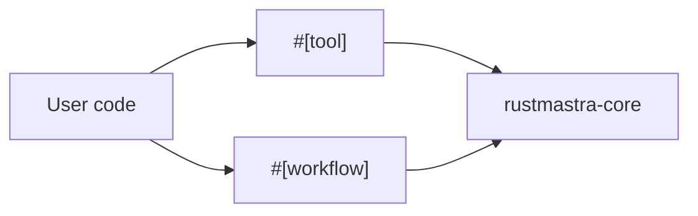
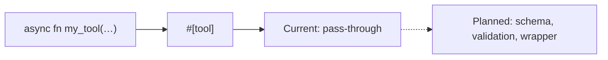
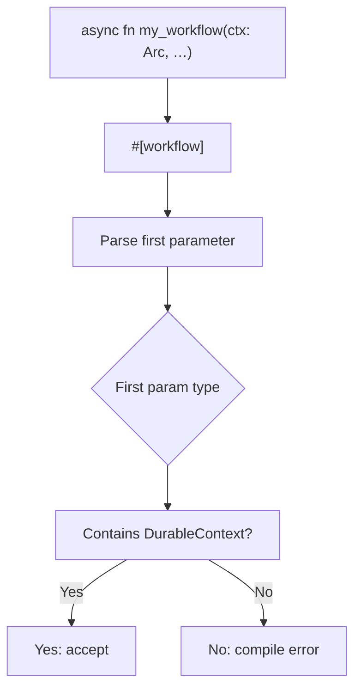
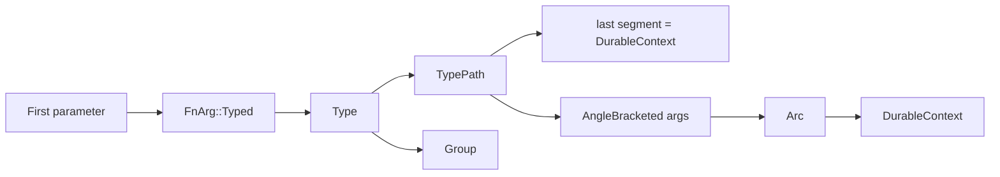

# Macros crate (rustmastra-macros)

Procedural macros for the RustMastra framework: **`#[tool]`** and **`#[workflow]`**.

## Crate role

- Macros live in **rustmastra-macros** and depend on **rustmastra-core** for types referenced in error messages and validation (e.g. `DurableContext`).

## #[tool]

- **Current behaviour**: Pass-through; the attribute does not change the function body.
- **Planned** (checklist §10): Derive JSON schema from parameter types (e.g. via schemars), extract description from Rustdoc, generate type-safe wrapper that deserializes model output and returns structured errors so the agent can self-correct.

## #[workflow]

- **Current behaviour**: Validates that the first parameter is `ctx: Arc<DurableContext>` (or equivalent path). If not, emits a compile error. Body is passed through (no transformation).
- **Intent**: Mark durable workflows; checkpoints are provided by `ctx.call_tool`, `ctx.sleep`, `ctx.run_once`. On recovery the function is re-run from the start and the journal replays side effects.

## Signature validation (workflow)

- The macro uses `syn` to inspect the first parameter; it accepts types whose path ends in `DurableContext` or that contain such a type (e.g. `Arc<DurableContext>`). Other types produce a clear compile error.
