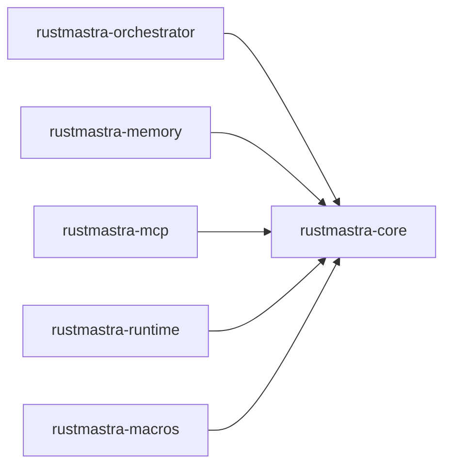

# Rust MCP server — what would have been more helpful

This doc lists capabilities or behaviors that would have made the rust-mcp server **much more useful** for the tasks we did (architecture docs, codebase exploration) and for typical Rust workflow in this repo.

---

## 1. Workspace-only crate graph

**What happened:** `generate_mermaid_diagram` with `diagram_type: "crate_graph"` returned the **full transitive dependency graph** (hundreds of crates).

**What would have been much more helpful:**

- A diagram type or parameter that limits the graph to **workspace members only** and the edges between them (e.g. `orchestrator -> core`, `mcp -> core`).
- Optional: one more “depth” level showing **direct** dependencies of workspace crates (e.g. `core` → `serde`, `tokio`) without the entire tree.

**Example desired output shape:**

---

## 2. File / module structure diagram for a crate

**What would help:** A diagram that shows **public modules and re-exports** for a crate (e.g. `rustmastra-core`), without diving into every symbol. For example:

- `lib.rs` → `config`, `message`, `traits`, `react`, `durable`, `providers`, `error`
- `traits` → `agent`, `runnable`, `tool`, `workflow`
- Which modules depend on which (for doc flowcharts).

So: **file_structure** (or similar) at **crate level**, not only per-file, to quickly see “what’s in this crate and how it’s grouped.”

---

## 3. “Where is this type / trait implemented?”

**What would help:** A tool that, given a type or trait name (and optionally a crate), returns:

- All impl blocks (with file:line).
- For traits: all implementors across the workspace.

That would have made it faster to document “what implements `ToolExecutor`” or “where is `Task` used” without grepping and opening many files.

---

## 4. Cargo workspace summary (no build)

**What would help:** A single call that returns structured data **without** running `cargo build` or `cargo check`:

- Workspace members and their paths.
- For each member: direct dependencies (workspace + crates.io), feature flags, and maybe `[lib]` / `[[bin]]` names.

Useful for docs and for the agent to “understand the workspace” without compiling.

---

## 5. Symbol list per file (with kind and visibility)

**What would help:** For a given `.rs` file, a list of **top-level items** with:

- Name, kind (fn, struct, enum, trait, impl, mod), and visibility (pub / pub(crate) / private).

That would have made it easier to write “Key types” tables in the architecture docs (e.g. “ExecutionGraph, GraphBuilder, FlowRunner, Task, NextAction”) without opening every file.

---

## 6. Doc comment extraction

**What would help:** For a symbol (or a file), return the **rustdoc comment** (and optionally the first paragraph or “short doc”). Helpful for:

- Auto-generating “purpose” bullets in architecture docs.
- Keeping docs in sync with the code (“this module does X” from the source).

---

## 7. Clear “workspace root” semantics

**What would help:** Every tool that takes a path or “project” parameter should clearly document:

- Whether it expects the **workspace root** (repo root with root `Cargo.toml`) or a crate directory.
- That workspace-root scope is preferred so the same call works for any crate in the workspace.

---

## Summary table

| # | Capability | Why it would have been much more helpful |
|---|------------|------------------------------------------|
| 1 | Workspace-only crate graph | The only diagram we tried was useless for high-level docs; we drew the graph by hand. |
| 2 | Crate-level module/structure diagram | Quick “map” of a crate for writing overviews. |
| 3 | “Where is X implemented?” | Fast answers for “who implements this trait?” when writing docs. |
| 4 | Workspace summary (no build) | Understand layout and deps without compile. |
| 5 | Symbol list per file (name, kind, visibility) | Easy “key types” tables and navigation. |
| 6 | Doc comment extraction | Reuse code’s own docs in architecture docs. |
| 7 | Explicit workspace-root semantics | Fewer wrong-path mistakes and clearer tool contracts. |

Implementing **#1 (workspace-only crate graph)** alone would have directly improved the architecture doc task; the rest would make the rust-mcp server much more helpful for future docs and refactors.
