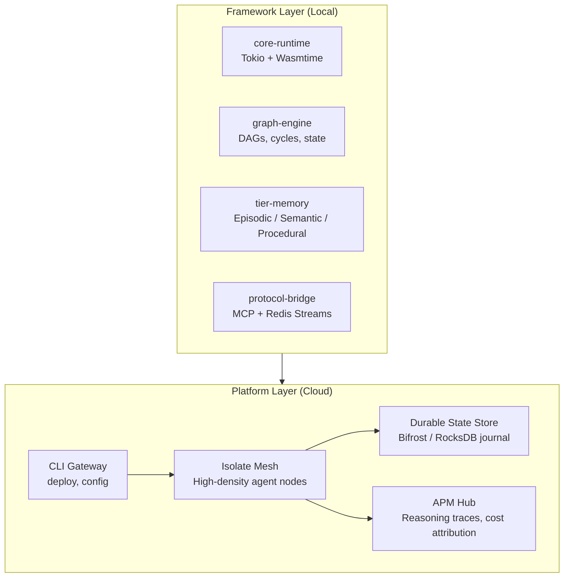
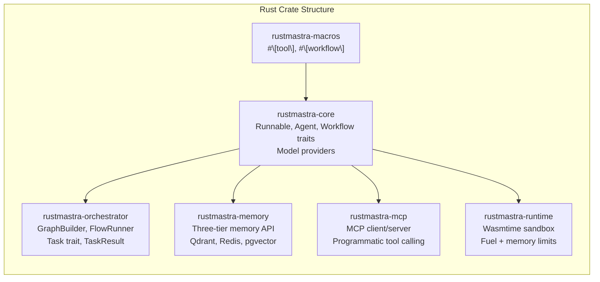
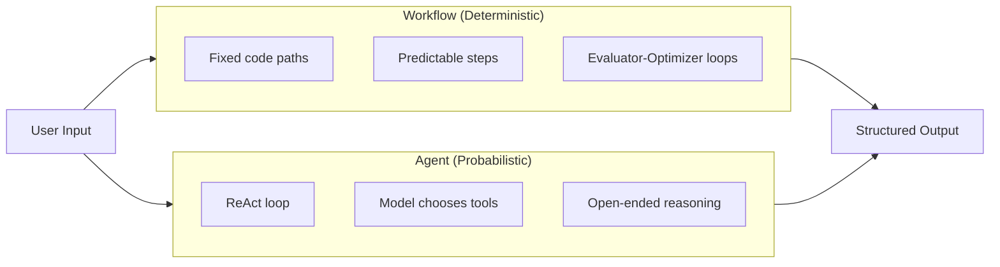

# Rust AI Agent Framework — Overview Architecture

This document describes the high-level architecture of the Rust AI Agent Framework: layers, crate structure, and how the framework relates to the managed platform.

## System Layers

The system is split into the **Framework** (local development) and the **Platform** (cloud execution).

## Crate Structure (Framework)

Modular crates keep binary size small and compilation fast.

## Workflow vs Agent (Type-System Separation)

Workflows are deterministic; agents are probabilistic. The framework enforces this in the type system.

## Performance Targets

| Metric | Target | Rationale |
|--------|--------|-----------|
| Cold start | < 10 ms | Enable thousands of isolates per host |
| Memory per agent | < 5 MB | High density (e.g. 1,500+ per 8GB VPS) |
| Tool isolation | WASM (Wasmtime) | Capability-gated, no host access |
| State persistence | Durable execution (Replay) | Resume after crash/migration |

## References

- *Rust Agent Framework Technical Specification* — Durable execution, graph orchestration, WASM–MCP, memory, convergence.
- *AI Agent Framework Strategy & PRD* — Architecture diagram, crate layout, platform vs framework.
- *Rust AI Framework Product Strategy* — RustMastra crate design, Workflow vs Agent, ACI.
