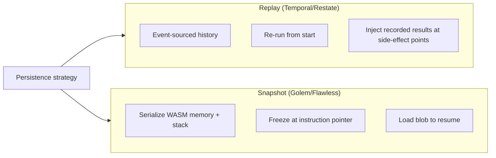
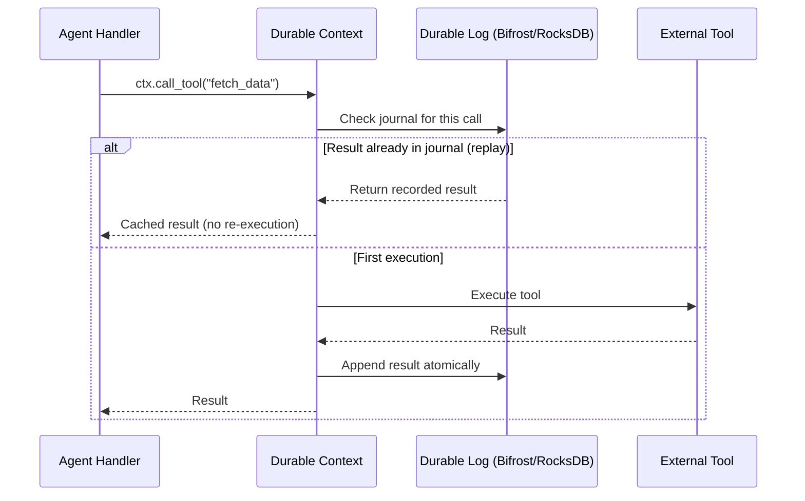
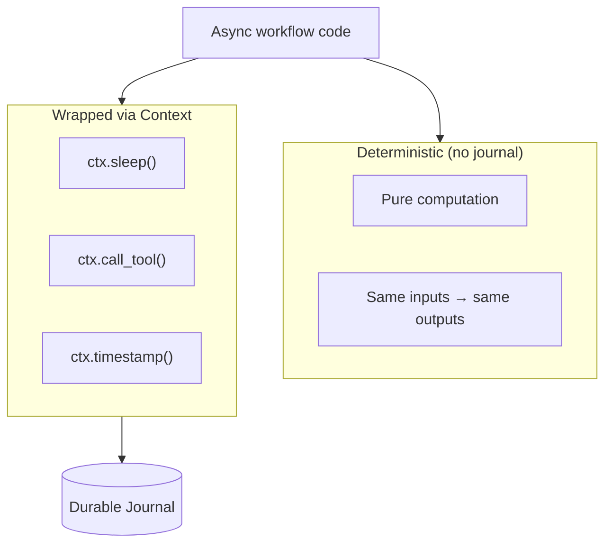
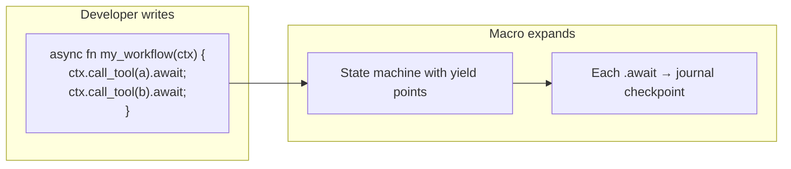
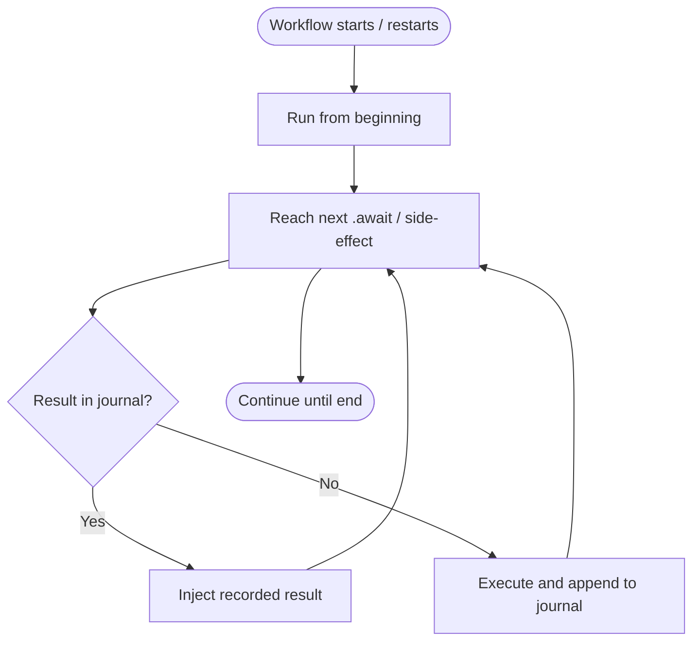

# Durable Execution Workflow

The framework uses **log-centric durable execution** (Replay approach) so workflows can pause, resume, and recover after crashes without losing progress.

## Replay vs Snapshot

Two main strategies for persisting agent execution:

The framework **recommends Replay** for low storage overhead and good recovery behavior at scale.

## Log-Centric Durable RPC Flow

Execution is driven by a **Context** that intercepts non-deterministic operations and consults a durable journal.

## Deterministic Wrapping

All non-deterministic operations go through the context so replay stays deterministic.

## Procedural Macro: #[workflow]

A `#[workflow]` macro injects yield points at every `.await`, so progress is persisted with each async step.

## Recovery After Crash

Resume is done by re-running from the beginning and replaying the journal.

## References

- Technical Specification: Replay vs Snapshot, Durable RPC, Bifrost, deterministic wrapping, `#[workflow]`.
- PRD: Managed state persistence, Restate-inspired engine.
