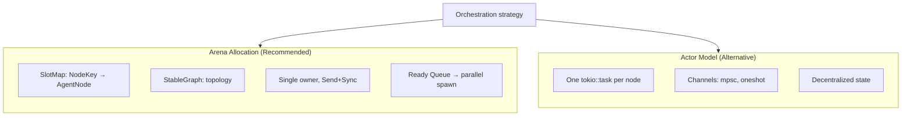
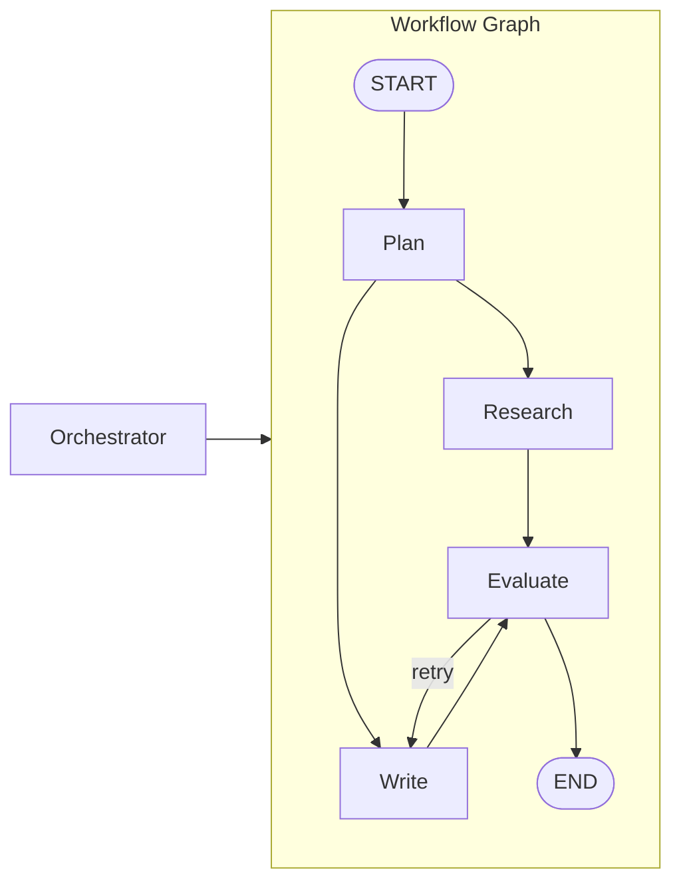
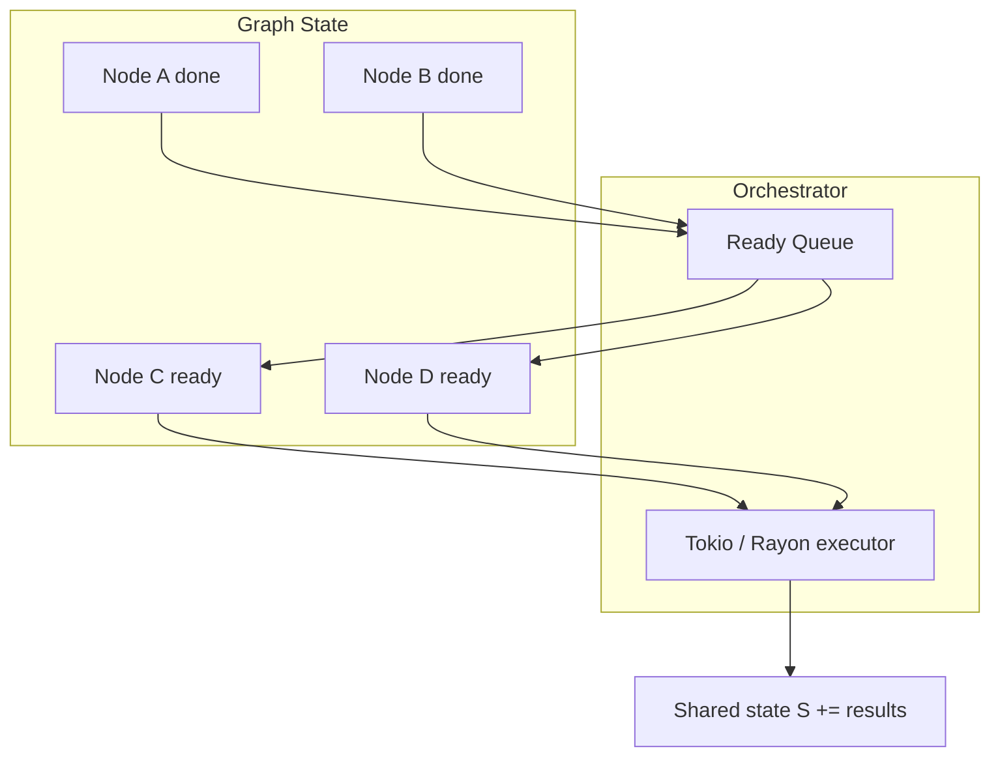
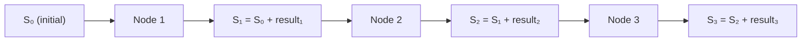
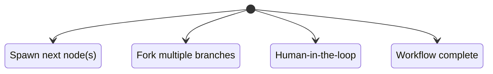
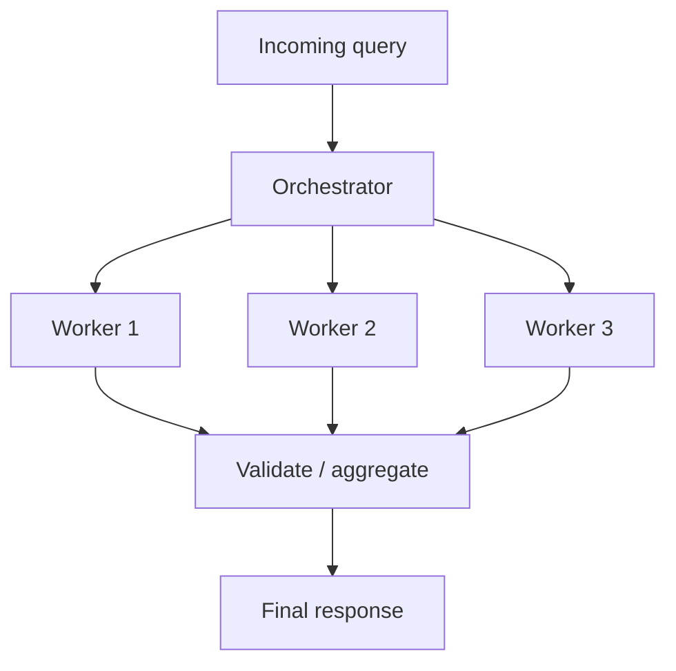

# Graph Orchestration Workflow

The framework uses a **generational arena** (slotmap + petgraph) for graph-based orchestration: DAGs and cycles, parallel execution, and clear ownership in Rust.

## Arena vs Actor Model

Orchestration is centralized in an arena; nodes are referenced by stable indices, not raw pointers.

## Graph Structure

Nodes are agent steps; edges are conditional transitions. The orchestrator walks the graph and runs ready nodes in parallel.

## Ready Queue and Parallel Execution

Nodes whose dependencies are satisfied enter a ready queue and can be executed in parallel.

## State Flow Through Graph

State is a shared container that accumulates results as the graph runs. Each node reads and updates it.

Formula: **S_{n+1} = S_n + f(node_n)** — state is persistent across nodes and supports pause/resume.

## Task Trait and NextAction

Each node implements a **Task** trait and returns a **TaskResult** that drives the next step.

## Alignment Principle

Centralized orchestration improves outcomes on parallelizable work (e.g. ~80.9% in studies) and acts as a validation bottleneck (e.g. 4.4x error containment vs 17.2x for independent agents).

## References

- Technical Specification: Arena allocation, petgraph, slotmap, cycles, ready queue.
- Product Strategy: GraphFlow, Task trait, FlowRunner, Orchestrator–Worker pattern.
