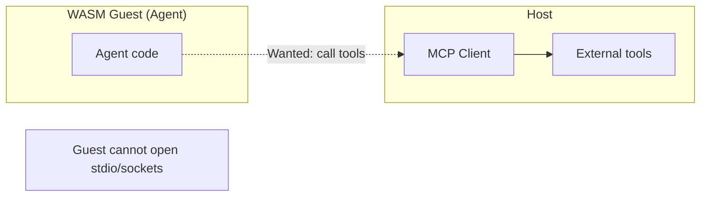
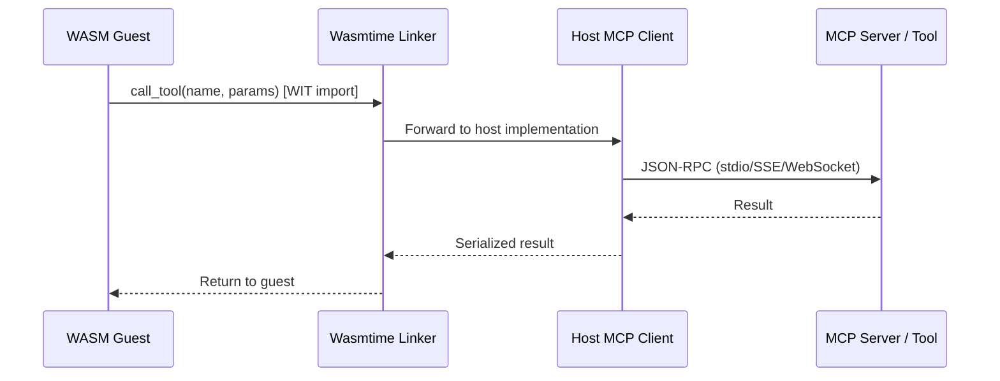
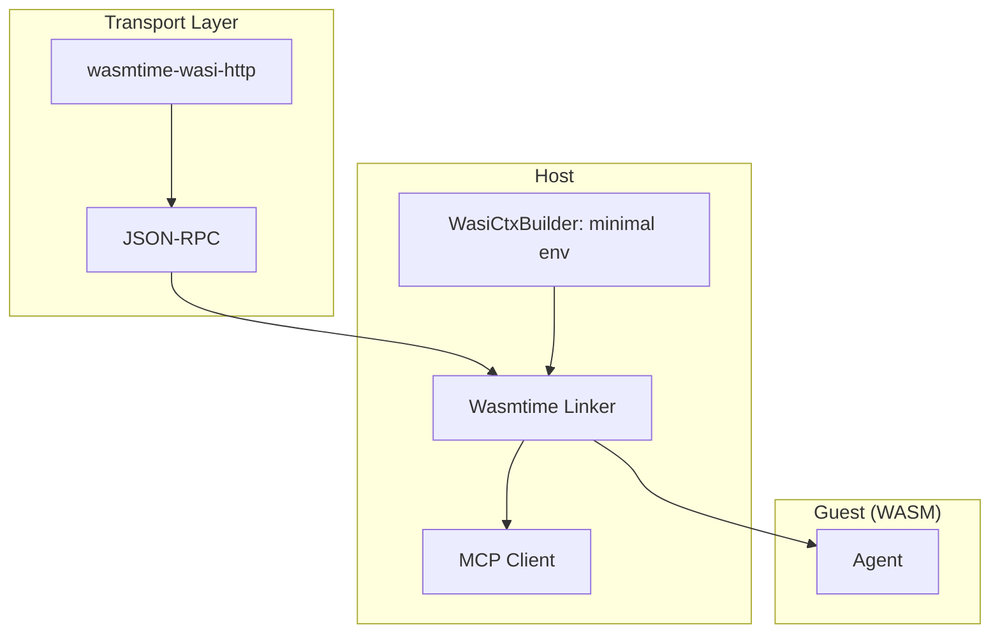
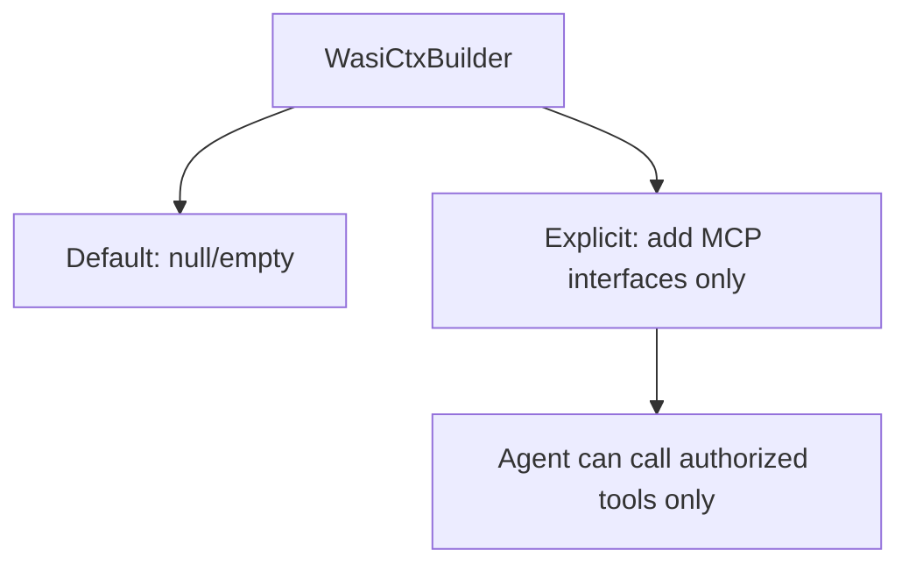

# WASM-to-MCP Bridge Workflow

Agents run in a **WASM sandbox** (Wasmtime) for security and sub-10ms cold starts. The **WASM-to-MCP bridge** lets sandboxed code call external tools via the Model Context Protocol without giving the guest host access.

## Problem: Sandbox vs MCP

MCP usually needs stdio or network; a default WASM sandbox has neither.

## Solution: Capability Tunneling

The host defines **WIT interfaces** that the guest imports. The Wasmtime linker binds these imports to the host’s MCP client so tool calls are proxied, not given raw I/O.

## wasmcp-Style Architecture

A chain of responsibility: the host handles MCP transport; one or more middleware components can handle or delegate tool calls.

## Component Roles

| Component | Role |
|-----------|------|
| **Wasmtime Linker** | Binds guest imports to host MCP functions |
| **WASI-Virt** | Virtualizes stdio/sockets so guest sees a bridge to MCP transport |
| **wasmcp** | Composes tool-calling components (reference pattern) |
| **jsonrpsee** | JSON-RPC (de)serialization on host |

## Strict Resource Limits

The guest gets only what it needs: no host filesystem or arbitrary network.

## Cold Start

Wasmtime can pre-initialize these interfaces quickly, keeping cold start under the &lt;10ms target while preserving a strong security boundary.

## References

- Technical Specification: WASM-to-MCP bridge, WASI-Virt, wasmcp, capability tunneling.
- PRD: WASM tool sandboxing, AOT, &lt;10ms tool execution.
