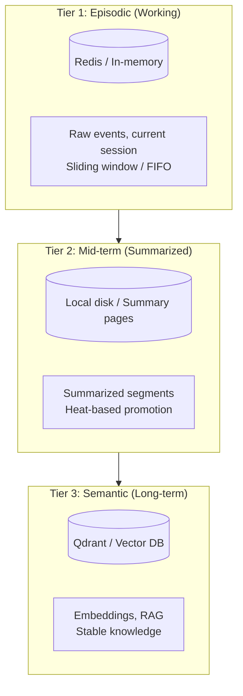
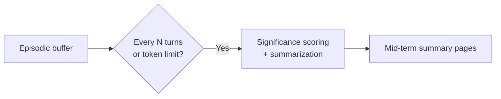
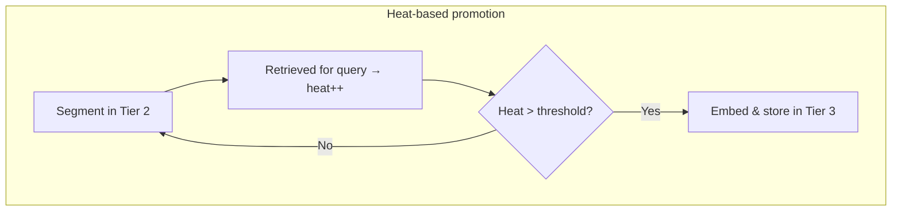
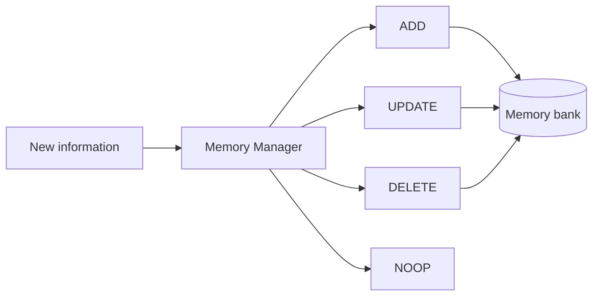
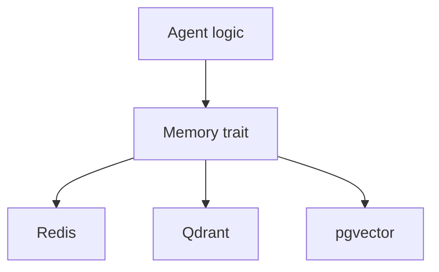

# Three-Tier Memory Workflow

The framework uses a **three-tier memory** model (Episodic → Mid-term → Semantic) with **heat-based consolidation** so important information is promoted and retained without blowing the context window.

## Tier Overview

## Consolidation: Tier 1 → Tier 2

After N turns or when the context window approaches a token limit, a summarization step runs. A small LLM scores “state-altering” information (e.g. user preferences) and writes summaries to Tier 2.

## Consolidation: Tier 2 → Tier 3 (Heat-Based)

Each summary segment has a **heat** value. When a segment is retrieved to answer a query, its heat increases. When heat exceeds a threshold, the segment is embedded and stored in the vector DB (Tier 3).

## Memory-R1 Style Conflict Resolution

When consolidating, a **Memory Manager** can apply CRUD-style operations (ADD, UPDATE, DELETE, NOOP) so the memory bank evolves instead of only appending.

## Storage and Consolidation Summary

| Tier | Storage | Consolidation |
|------|---------|----------------|
| **Tier 1: Episodic** | Redis / in-memory | Sliding window / FIFO |
| **Tier 2: Mid-term** | Local disk / summary pages | Heat-based promotion |
| **Tier 3: Semantic** | Qdrant / vector DB | Embedding-based RAG |

## Trait-Based Abstraction

A common **Memory** trait lets you swap backends (e.g. SQLite for dev, pgvector/Redis for production) without changing agent logic.

## References

- Technical Specification: Three-tier memory, heat-based consolidation, Memory-R1, Qdrant, Redis.
- PRD & Product Strategy: Episodic / Semantic / Procedural, trait-based API.
