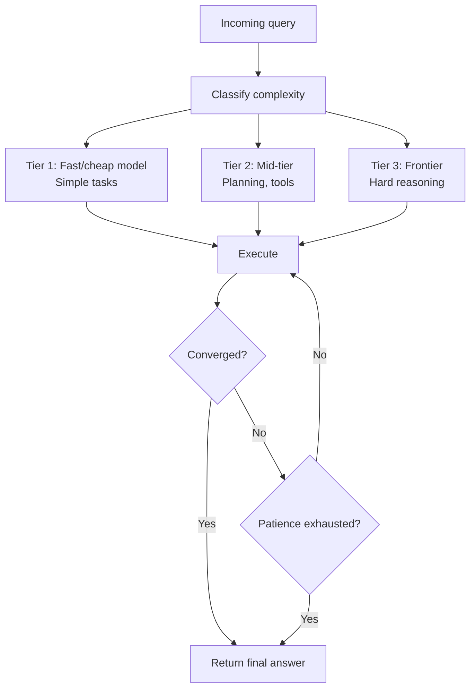
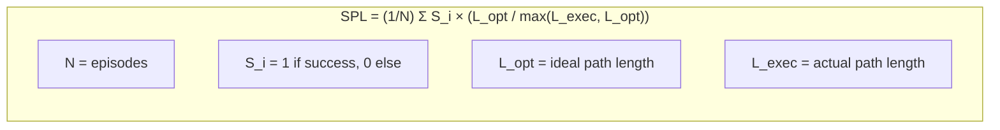
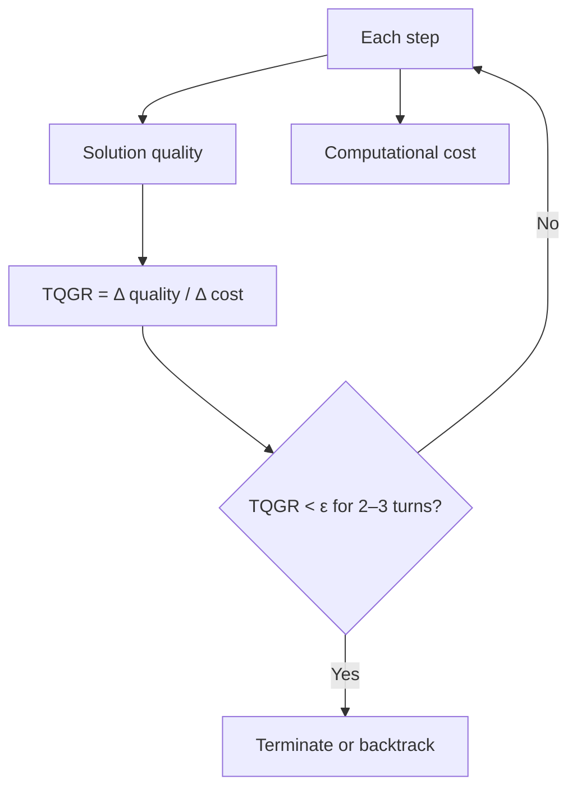
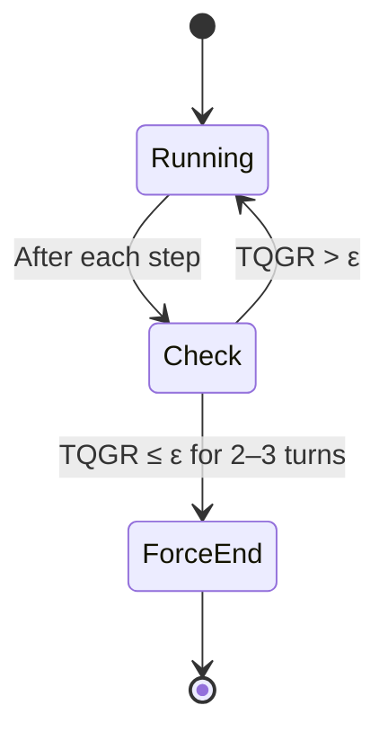
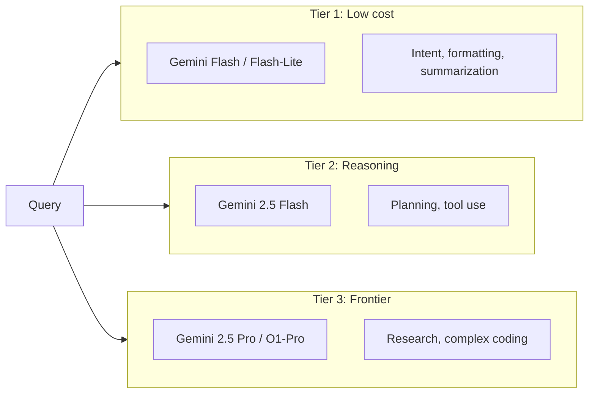
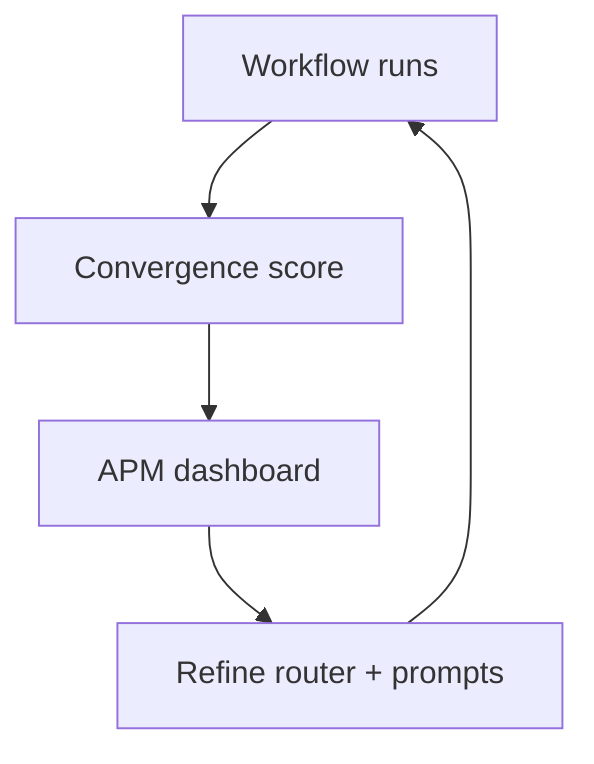

# Supervisor Agent and Convergence Metrics

The **SupervisorAgent** routes work and decides when a workflow is done. **SPL** and **TQGR** quantify trajectory efficiency and convergence so the system can stop or backtrack when the agent is stuck.

## Supervisor Role

The supervisor classifies incoming work and routes it to the right tier; it also decides when to terminate or escalate.

## Success weighted by Path Length (SPL)

SPL measures how close the agent was to the **shortest** successful path.

- **Ideal path length** L_opt: minimum steps needed for a correct solution.
- **Executed path length** L_exec: steps the agent actually took.
- SPL is 1 when the agent succeeds in the minimal number of steps; detours or failure reduce it.

## Trajectory-Quality Growth Rate (TQGR)

TQGR relates **improvement in solution quality** to **cost (steps)**. If TQGR stays near or below zero for several steps, the agent is no longer improving (converged or stuck).

## Patience and Termination

The supervisor uses TQGR to implement a **patience** parameter: if more steps don’t improve (or worsen) the answer, it forces a final answer or failure.

## Model Tiering (FinOps)

Routing by complexity keeps cost and latency in check.

## Convergence Score in APM

The platform tracks **convergence score** (e.g. ratio of optimal to actual path length) so you can tune routing and prompts.

## References

- Technical Specification: SPL, TQGR, SupervisorAgent, patience, trajectory efficiency.
- Product Strategy: SupervisorAgent, model tiering, FinOps, convergence score.
