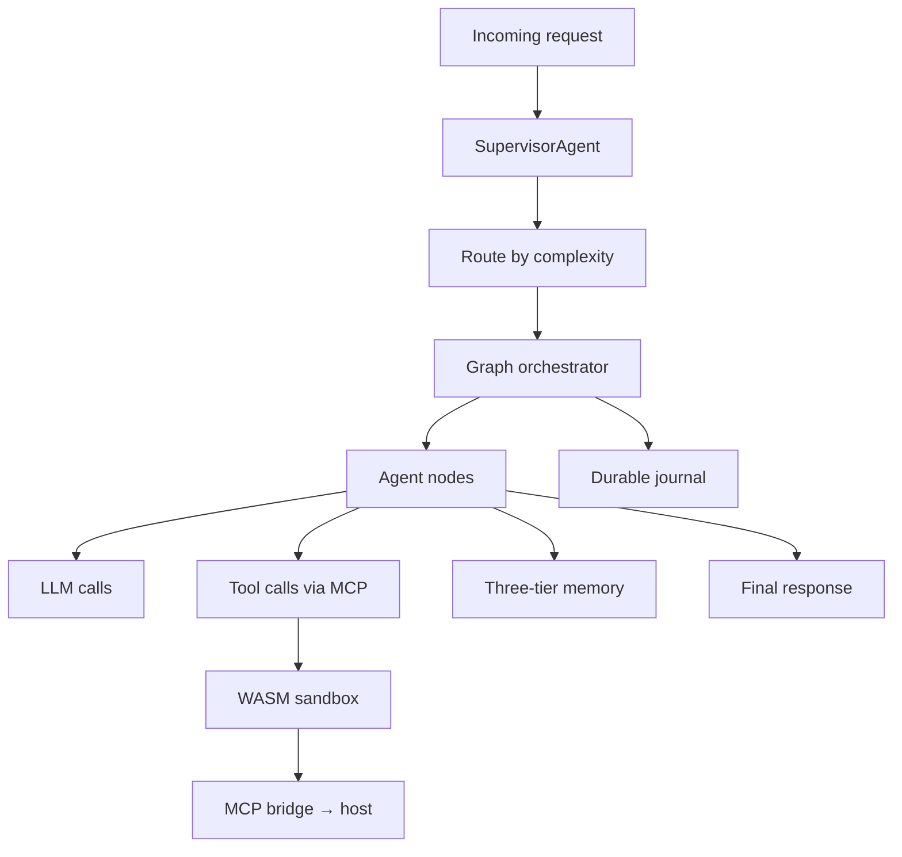
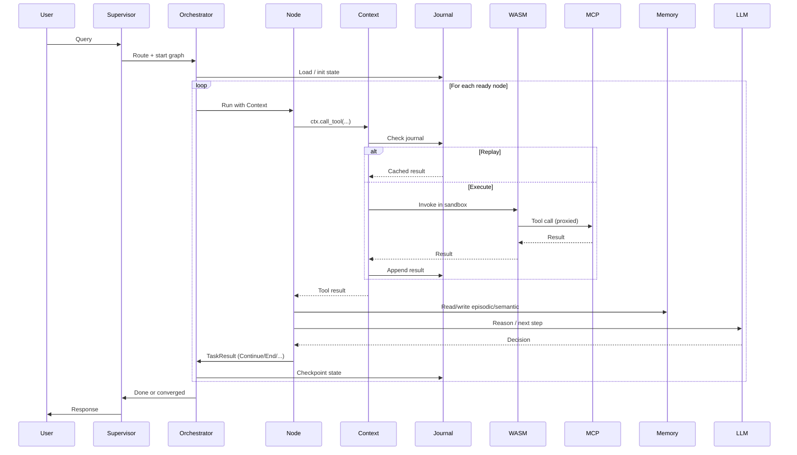
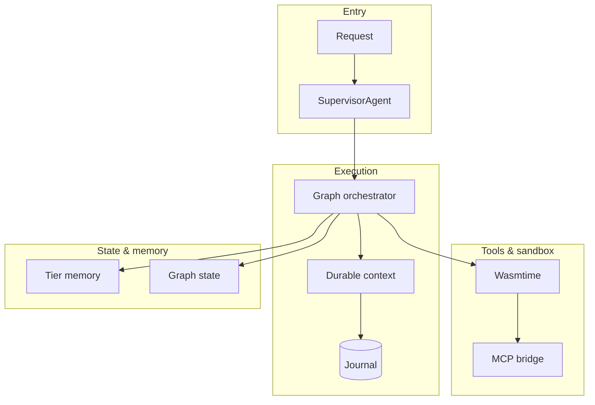
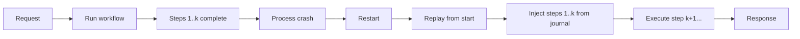
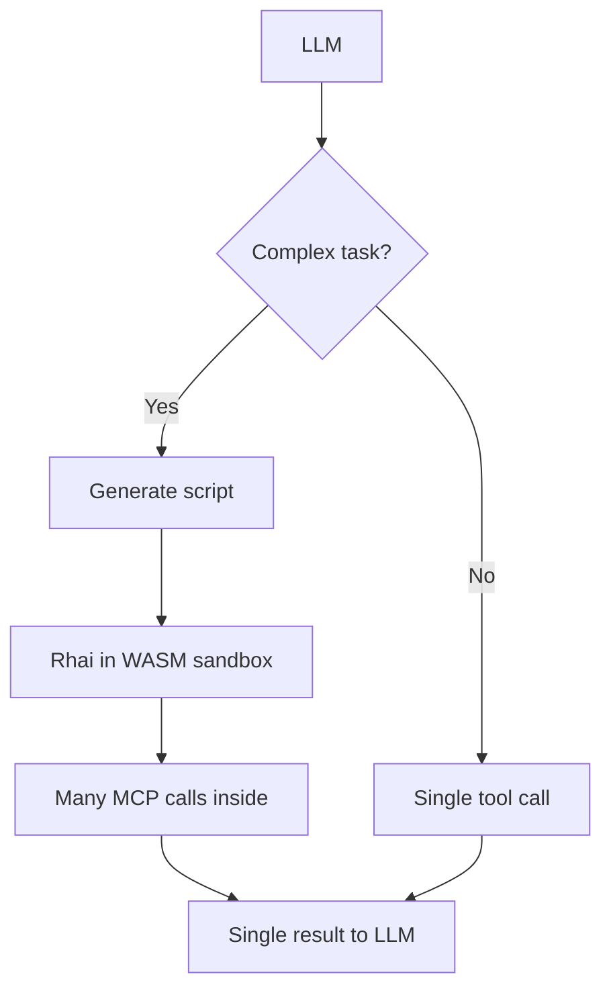

# End-to-End Request Flow

This document ties together the main components: from an incoming request through orchestration, tools, memory, and durable execution to a final response.

## High-Level Request Path

## Detailed Sequence: One Agent Turn

## Component Interaction Map

## Failure and Resume

If the process dies mid-run, the next run replays from the journal and continues.

## Code Mode (Programmatic Tool Calling)

For heavy tool use, the agent can emit a **script** (e.g. Rhai) that runs in the sandbox and calls MCP tools internally; only the final result is returned to the LLM. This reduces tokens and keeps large data out of context.

## References

- All prior workflow docs: durable execution, graph orchestration, WASM–MCP, memory, supervisor.
- Technical Specification & PRD: end-to-end architecture, crate roles, platform vs framework.
