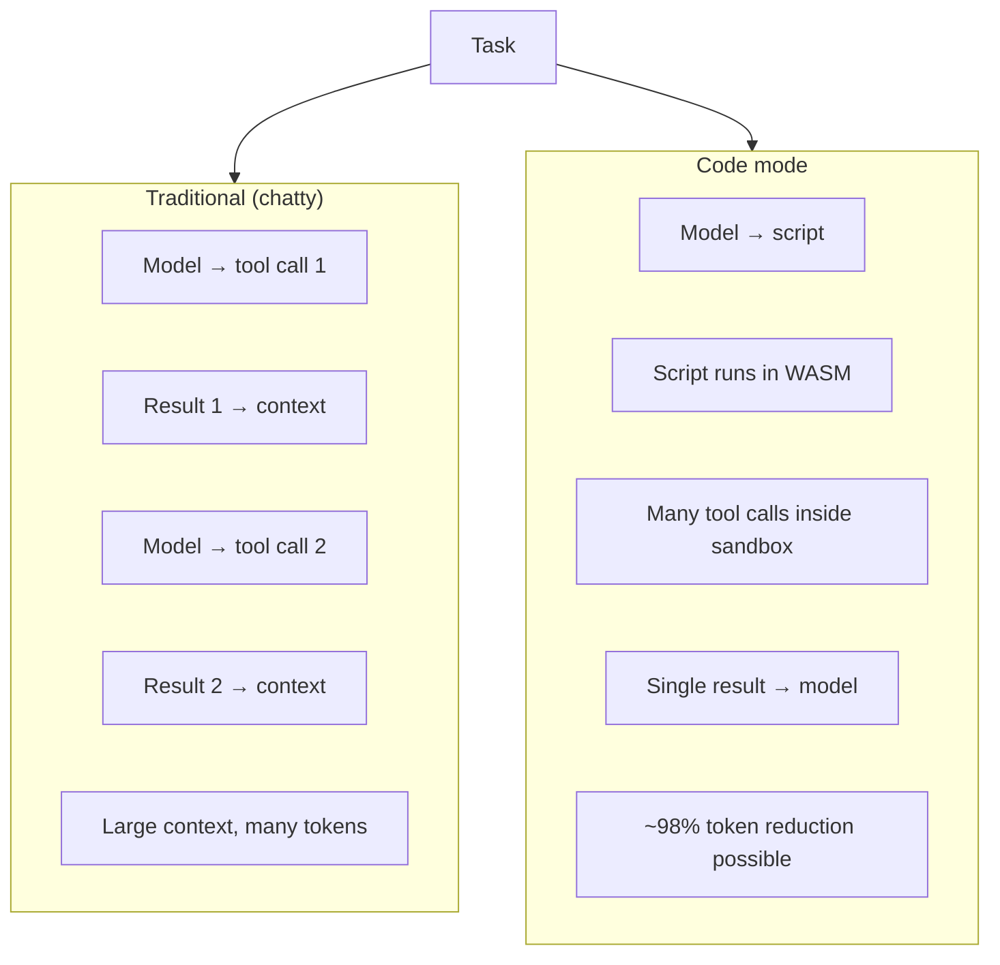
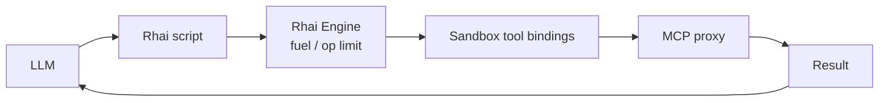
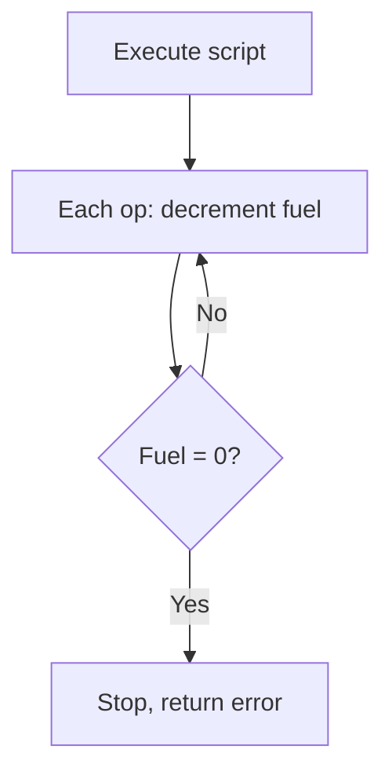
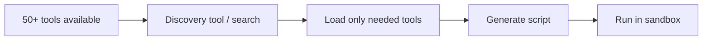

# ACI and Code Mode (Scripting) Workflow

The **Agent-Computer Interface (ACI)** is how the model sees and uses tools. The framework uses a **Poka-yoke** style (mistake-proofing) and supports **Programmatic Tool Calling (Code Mode)** via an embedded scripting engine (e.g. Rhai) in the WASM sandbox.

## ACI: Tools as Interface

Tools are documented and typed so the model can choose and invoke them correctly. The `#[tool]` macro generates JSON schemas and type-safe wrappers from Rust.

```mermaid
flowchart LR
    subgraph Dev["Developer"]
        Rust[#[tool] fn fetch_order_history(...)]
        Doc[Rustdoc comments]
    end

    subgraph Macro["rustmastra-macros"]
        Schema[JSON schema]
        Wrapper[Type-safe wrapper]
    end

    subgraph Model["Model"]
        See[Sees: name, params, description, examples]
        Call[Outputs tool call]
    end

    Rust --> Schema
    Doc --> Schema
    Rust --> Wrapper
    Schema --> See
    Call --> Wrapper
    Wrapper --> Execute[Execute or return validation error]
```

## Poka-yoke Design

ACI is designed to make wrong usage hard: clear names, enums, constraints, and error messages that the model can use to self-correct.

```mermaid
flowchart TB
    subgraph PokaYoke["Poka-yoke elements"]
        Name[Clear, specific names\n(e.g. fetch_order_history)]
        Types[Strict types, enums, min/max]
        Desc[When/how to use, examples]
        Errors[Structured errors returned to model]
    end

    Model[Model] --> PokaYoke
    PokaYoke --> Fewer[Fewer wrong tool choices\n+ parse errors]
```

## JSON Tool Calling vs Code Mode

Traditional flow: one LLM turn per tool call, full result back into context. Code mode: agent writes a script that runs in the sandbox and calls tools; only the final result goes back to the model.



## Rhai in the Sandbox

The framework recommends **Rhai** for Code Mode: small binary, gas metering, and minimal build options.



## Gas Metering

Rhai’s instruction/op limit acts as “gas” so a bad or malicious script cannot run forever.



## MCP Discovery and Code Mode

For large tool sets, the model can **discover** tools (e.g. list MCP servers or search) and then generate a script that uses only the ones it needs, keeping context small.



## References

- Technical Specification: Rhai, minimal build, gas metering, Code Mode.
- Product Strategy & Anthropic Bible: ACI, Poka-yoke, `#[tool]`, programmatic tool calling, MCP as code API.
