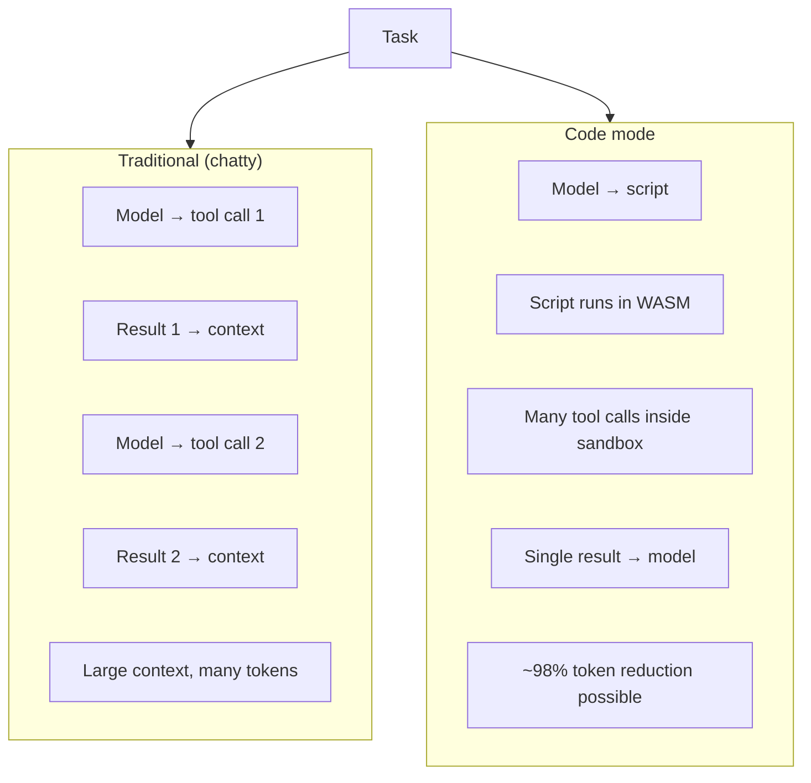
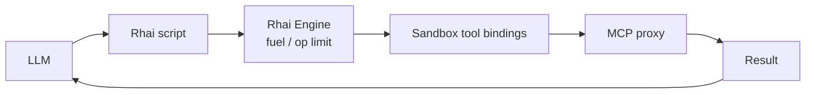
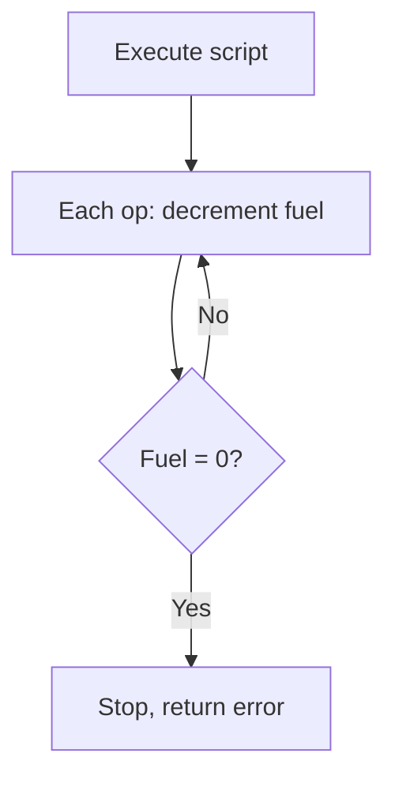
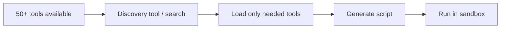

# ACI and Code Mode (Scripting) Workflow

The **Agent-Computer Interface (ACI)** is how the model sees and uses tools. The framework uses a **Poka-yoke** style (mistake-proofing) and supports **Programmatic Tool Calling (Code Mode)** via an embedded scripting engine (e.g. Rhai) in the WASM sandbox.

## ACI: Tools as Interface

Tools are documented and typed so the model can choose and invoke them correctly. The `#[tool]` macro generates JSON schemas and type-safe wrappers from Rust.

```mermaid
flowchart LR
    subgraph Dev["Developer"]
        Rust[#[tool] fn fetch_order_history(...)]
        Doc[Rustdoc comments]
    end

    subgraph Macro["openswarm-macros"]
        Schema[JSON schema]
        Wrapper[Type-safe wrapper]
    end

    subgraph Model["Model"]
        See[Sees: name, params, description, examples]
        Call[Outputs tool call]
    end

    Rust --> Schema
    Doc --> Schema
    Rust --> Wrapper
    Schema --> See
    Call --> Wrapper
    Wrapper --> Execute[Execute or return validation error]
```

## Poka-yoke Design

ACI is designed to make wrong usage hard: clear names, enums, constraints, and error messages that the model can use to self-correct.

```mermaid
flowchart TB
    subgraph PokaYoke["Poka-yoke elements"]
        Name[Clear, specific names\n(e.g. fetch_order_history)]
        Types[Strict types, enums, min/max]
        Desc[When/how to use, examples]
        Errors[Structured errors returned to model]
    end

    Model[Model] --> PokaYoke
    PokaYoke --> Fewer[Fewer wrong tool choices\n+ parse errors]
```

### Tool naming (§10.7)

Use **clear, specific** names so the model can choose the right tool and infer parameters:

- **Verb_noun** or **verb_noun_detail**: e.g. `fetch_order_history`, `search_codebase`, `read_file`, `create_branch`.
- Avoid vague names: prefer `fetch_order_history` over `get_data`, `search_docs` over `query`.
- Names should hint at the domain: `cancel_subscription`, `list_available_slots`, `validate_schema`.

The `#[tool]` macro exposes the function name as the tool name; keep Rust fn names and tool names aligned.

### Enums, min/max, and paths (§10.6)

- **Enums**: Use Rust enums for parameters that have a fixed set of values. The `#[tool]` macro derives the params struct with `schemars::JsonSchema`; schemars emits an `enum` array in the JSON schema so the model only sees valid options (e.g. `status: "pending" | "done" | "cancelled"`).
- **Min/max**: For numeric bounds, use a newtype with a custom `JsonSchema` impl that sets `minimum`/`maximum`, or validate in the tool and return a structured error. Schema-level min/max can be added in a future macro expansion.
- **Absolute paths**: Where tools accept file paths, constrain them to a root so the model cannot escape (e.g. `ReadFileTool::new(root)` in core). Paths are relative to that root; reject `..` and absolute paths and document that in the tool description.

### Error handling (§10.8)

Return **structured errors as tool results** so the model can self-correct instead of failing the turn:

- On validation failure (wrong type, missing required field): return a **tool result** (not a panic or 500) with a short, actionable message, e.g. `{"error": "invalid_params", "message": "order_id must be a non-empty string"}`.
- On external failure (API down, file not found): return a result with a clear code and suggestion, e.g. `{"error": "not_found", "message": "Order 123 not found", "suggestion": "Check order_id or list recent orders"}`.
- The framework deserializes model output and can return validation errors back into the conversation; the model sees them as tool output and can retry with corrected arguments.

Keep error payloads small and readable so they fit in context and guide the next action.

### When to use which tool (§10.12)

- **Discovery**: The model sees only the tool list and schemas you provide. Give each tool a **distinct purpose** (e.g. `fetch_order_history` vs `cancel_order`) so the model can choose the right one.
- **One task per tool**: Prefer several focused tools over one “do everything” tool. If a tool does two unrelated things, split it or document clearly when to use which “mode.”
- **Use tool descriptions**: Put “Use when …” in the description so the model knows _when_ to call (e.g. “Use when the user asks for the current time or date” for a `time` tool).
- **Handle errors in context**: When a tool returns an error (validation or external), the model sees it as tool output. Document in your ACI that the model should read the error message and retry with corrected inputs or a different tool when appropriate.

### Thinking time and XML-style tags (§10.10)

Allow the model to **reason before** each tool call so it chooses tools more reliably. Enable with `AgentConfig::with_chain_of_thought()`; the framework appends an instruction that the model should reason inside `<thinking>…</thinking>` tags. Parsing: use `openswarm_core::extract_xml_blocks(assistant_text, "thinking")` to get a list of thinking segments from the assistant message (e.g. for observability or to strip thinking from the final answer). Other XML-style tags can be parsed the same way for custom protocols.

## JSON Tool Calling vs Code Mode

Traditional flow: one LLM turn per tool call, full result back into context. Code mode: agent writes a script that runs in the sandbox and calls tools; only the final result goes back to the model.



## Rhai in the Sandbox

The framework recommends **Rhai** for Code Mode: small binary, gas metering, and minimal build options.



## Gas Metering

Rhai’s instruction/op limit acts as “gas” so a bad or malicious script cannot run forever.



## MCP Discovery and Code Mode

For large tool sets, the model can **discover** tools (e.g. list MCP servers or search) and then generate a script that uses only the ones it needs, keeping context small.



## References

- Technical Specification: Rhai, minimal build, gas metering, Code Mode.
- Product Strategy & Anthropic Bible: ACI, Poka-yoke, `#[tool]`, programmatic tool calling, MCP as code API.
