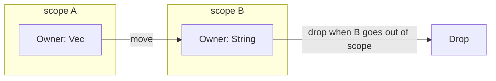
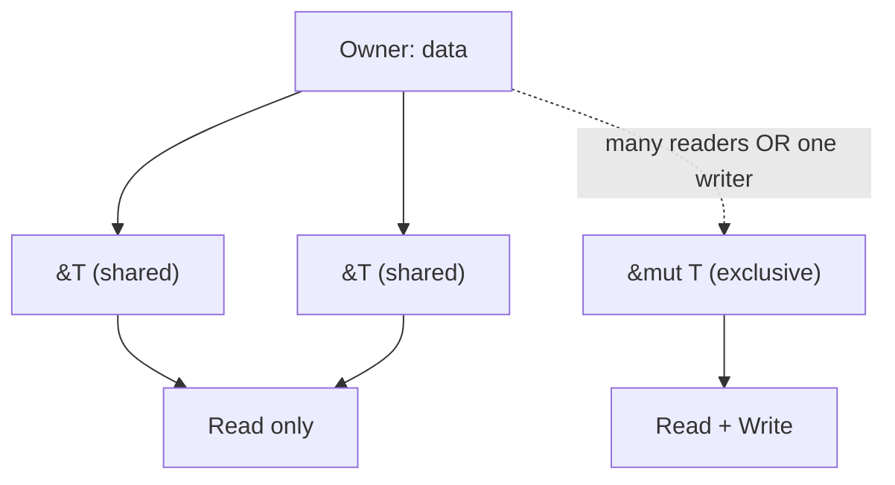
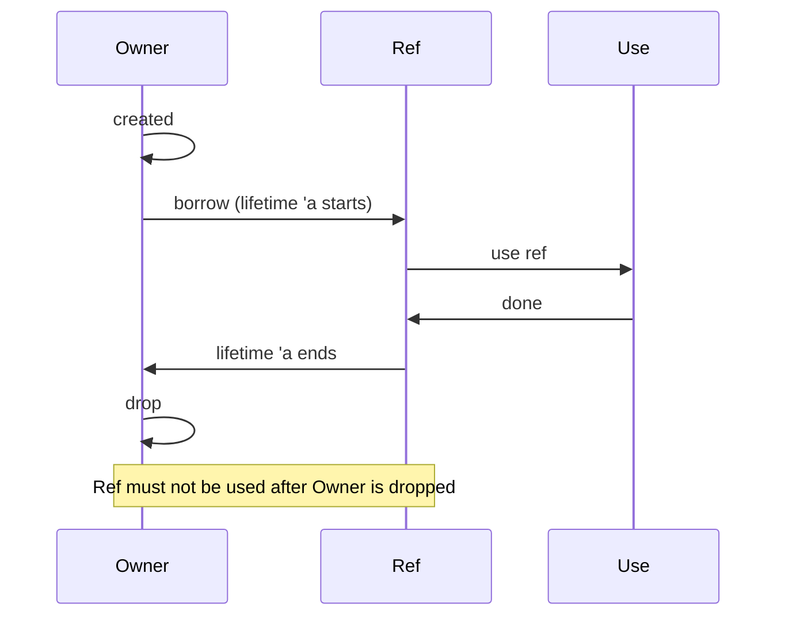
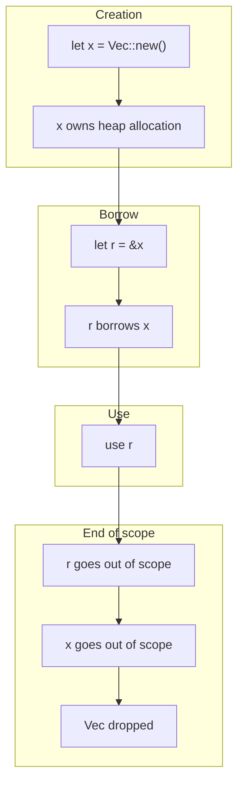

# Ownership and Lifetimes

Ownership and lifetimes are the core of Rust’s memory model. They give you memory safety and no data races **at compile time**, without a garbage collector.

## Why This Matters

- **No GC pauses** — the compiler enforces who owns data and when it’s dropped.
- **No use-after-free** — the borrow checker rejects invalid references.
- **No data races** — aliasing and mutation rules are enforced statically.
- **Predictable performance** — allocation and deallocation are explicit.

Use this model whenever you care about safety and performance; it’s why Rust is a good fit for systems code, agents, and high-density runtimes.

---

## Ownership: One Owner at a Time

Every value has exactly **one** owner. When the owner goes out of scope, the value is dropped.



**Rules:**

1. Each value has one owner.
2. When the owner goes out of scope, the value is dropped.
3. Assigning or passing by value **moves** ownership (for non-`Copy` types).

```rust
let v = vec![1, 2, 3];  // v owns the Vec
let w = v;               // ownership moves to w; v is no longer valid
// println!("{:?}", v);  // compile error: use of moved value
```

---

## Borrowing: References Without Ownership

Instead of moving, you can **borrow** with `&T` (shared) or `&mut T` (exclusive).



**Borrow rules:**

- Any number of `&T` (shared borrows) **or** exactly one `&mut T` (mutable borrow), not both.
- Borrows must not outlive the owner.

```rust
let mut v = vec![1, 2, 3];
let r1 = &v;      // shared borrow OK
let r2 = &v;      // another shared borrow OK
// let r3 = &mut v;  // error: cannot borrow v as mutable while r1, r2 exist
```

---

## Lifetimes: How Long References Live

Lifetimes are **names for the span of time** during which a reference is valid. The compiler uses them to prove no reference outlives its referent.



**Why they’re useful:** They encode “this reference is only valid while that value exists.” Without lifetimes, the compiler couldn’t prove safety for references in structs, function signatures, or across async boundaries.

**When they show up:**

- Functions that take or return references.
- Structs that hold references.
- When the compiler can’t infer and asks you to name the relationship.

```rust
// Explicit lifetime: 'a connects input and output
fn longest<'a>(x: &'a str, y: &'a str) -> &'a str {
    if x.len() > y.len() { x } else { y }
}
```

**Lifetime elision:** The compiler often infers lifetimes using a few rules (one in, one out; one `&mut` in, one out; etc.). You only add `'a` when inference fails or you want to document the contract.

---

## Visual: Ownership and Borrows Over Time



---

## Common Patterns

| Pattern | Use case |
|--------|----------|
| **Move** | Transfer ownership (e.g. into a collection or another thread). |
| **`&T`** | Read-only access; many borrows allowed. |
| **`&mut T`** | Single exclusive access for mutation. |
| **`clone()`** | When you need a second owned value (cost is explicit). |
| **Lifetime `'a`** | When a function or struct ties reference validity to another reference or value. |

---

## Why It’s “Advanced”

- **Borrow checker errors** can be confusing until you think in terms of “who owns what” and “who is borrowing.”
- **Lifetime syntax** (`'a`, `'static`) and when to add it takes practice.
- **Non-lexical lifetimes (NLL)** make more code compile by reasoning about *use* of references, not just scope.

Mastering ownership and lifetimes lets you design APIs that are safe by construction and avoid runtime checks; that’s why they’re central to advanced Rust.
