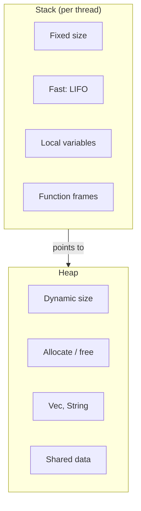
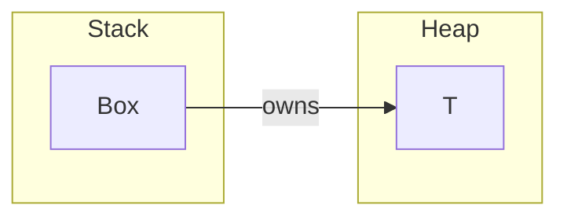
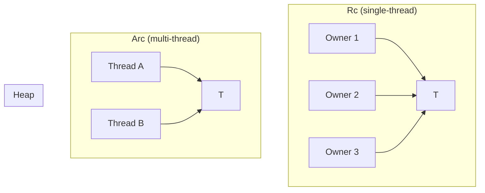
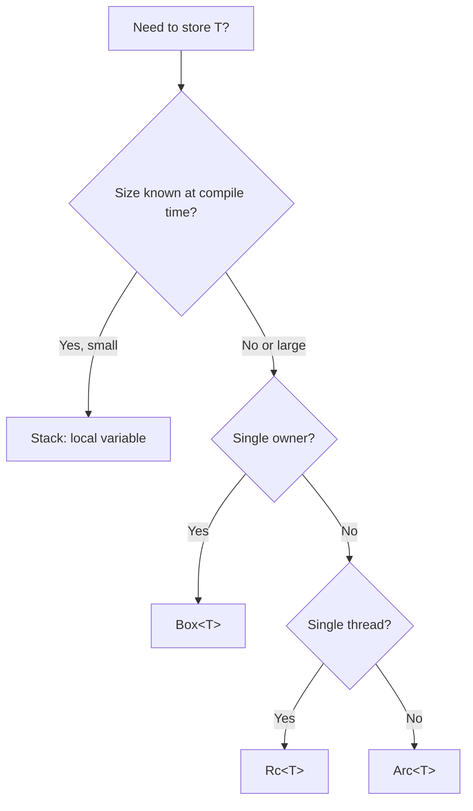

# Heap, Stack, and Smart Pointers

Rust gives you explicit control over where data lives (stack vs heap) and how it’s shared. That’s essential for performance and for building runtimes, caches, and graphs.

## Why This Matters

- **Stack** — fast, fixed size, automatic cleanup. Good for locals and fixed-size data.
- **Heap** — dynamic size, lives until freed or no longer referenced. Good for collections, large buffers, and shared data.
- **Smart pointers** — (`Box`, `Rc`, `Arc`, etc.) encode *who* owns or shares heap data and *how* (single-thread vs multi-thread).

Use the heap when you need dynamic size, dynamic lifetime, or shared ownership; use smart pointers to keep ownership and threading rules clear and safe.

---

## Stack vs Heap



| Aspect | Stack | Heap |
|--------|--------|------|
| **Size** | Known at compile time (or fixed frame size) | Can grow at runtime |
| **Speed** | Very fast (push/pop) | Slower (allocator, indirection) |
| **Lifetime** | Tied to scope | Until explicitly freed or last owner drops |
| **Use for** | Primitives, small structs, local refs | `Vec`, `String`, large or variable-size data |

---

## Box&lt;T&gt;: Single Ownership on the Heap

`Box<T>` puts a single value on the heap. One owner; when the `Box` is dropped, the heap allocation is freed.



**When to use:**

- Type has a **dynamic size** (e.g. recursive type, or trait object `dyn Trait`).
- You want to **move a large value** without copying (ownership moves, pointer is small).
- You explicitly want **one heap allocation** for a value.

```rust
// Recursive type: List needs indirection
enum List {
    Cons(i32, Box<List>),
    Nil,
}
```

---

## Rc&lt;T&gt; and Arc&lt;T&gt;: Shared Ownership

When multiple owners need to keep a value alive, use **reference counting**:

- **`Rc<T>`** — single-threaded shared ownership.
- **`Arc<T>`** — multi-threaded shared ownership (atomic ref count).



**When to use:**

- **`Rc<T>`**: Shared read-only (or with interior mutability) data in one thread (e.g. graph nodes, caches).
- **`Arc<T>`**: Same across threads (e.g. config, read-only cache, shared handles). Often used with `Mutex`/`RwLock` for shared mutable state.

**Cost:** Ref count updates on clone/drop; `Arc` uses atomic operations. Prefer ownership or borrowing when you don’t need shared ownership.

---

## When to Use Which



---

## Relation to Our Framework

- **Arena (slotmap + petgraph)** — many “nodes” live in one container; the arena owns them, we use indices (no `Rc`/ref count per node).
- **Agents/tools** — often `Arc<dyn ModelProvider>`, `Arc<dyn ToolExecutor>` for shared, read-only or externally synchronized access across the runtime.
- **Durable journal** — large logs live on heap (e.g. `Vec<Entry>`, or memory-mapped/disk); we avoid unnecessary boxing of small entries.

Understanding heap vs stack and smart pointers helps you choose the right abstraction and avoid unnecessary allocation or ref counting in hot paths.
