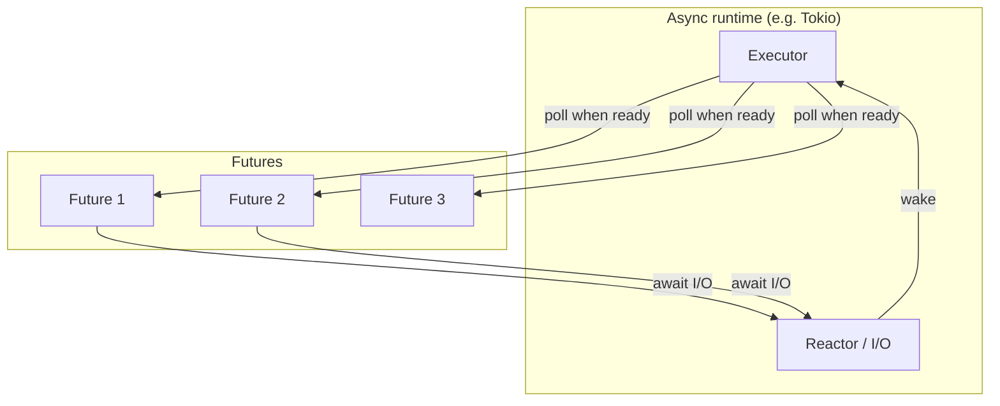
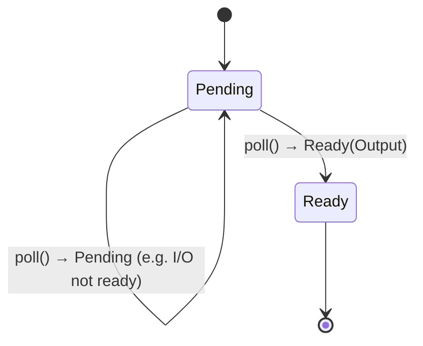
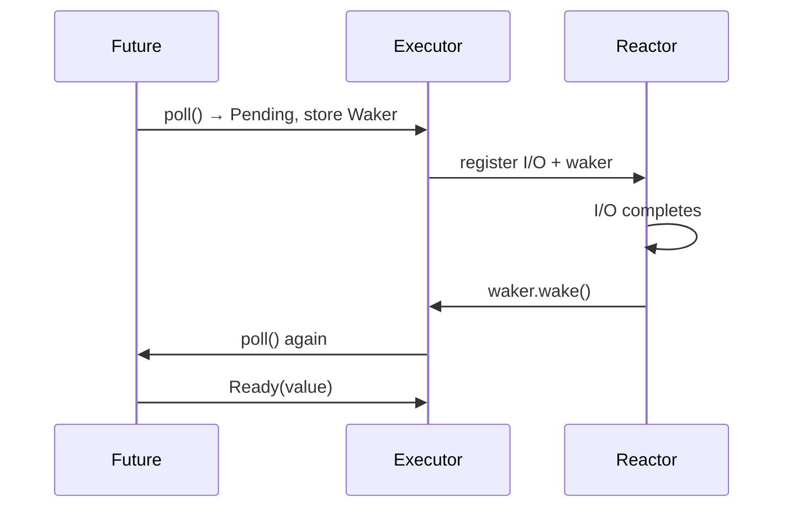
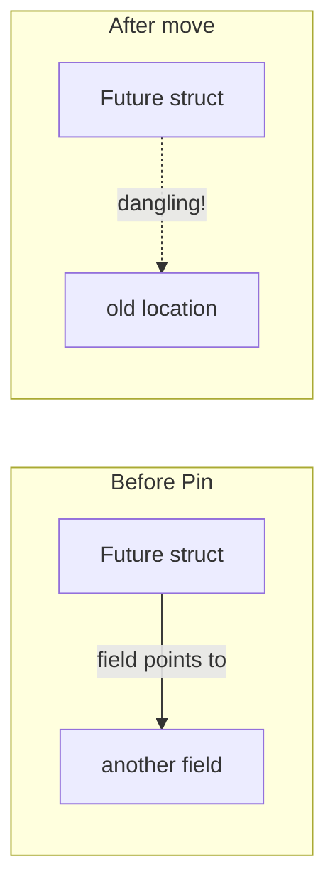
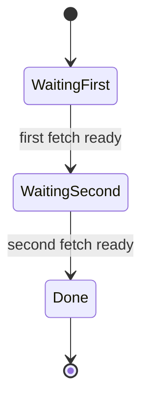

# Async Rust: Futures, Executors, and async/await

Async Rust lets you run many concurrent tasks without a thread per task. That’s how we get high-density agent runtimes and scalable I/O.

## Why This Matters

- **Concurrency without a thread per task** — one OS thread can drive thousands of pending futures.
- **No global lock** — unlike a GIL; true multi-core utilization.
- **Structured cancellation** — dropping a future stops it; you can build timeouts and scoped tasks.
- **Critical for our framework** — agents, tool calls, and the graph engine are async; durable execution and MCP are I/O-bound.

Use async when you have I/O-bound work (network, disk, timers) or when you want many logical tasks with low memory per task. Use threads for CPU-bound work or when you need OS-level isolation.

---

## The Async Model in One Picture



A **Future** is a value that represents “work that may complete later.” The **executor** calls `poll` on futures; when a future is waiting on I/O, it returns `Poll::Pending` and stores a **Waker**. When the I/O is ready, the reactor wakes the waker and the executor polls again. **async/await** is syntax that produces state machines implementing `Future`.

---

## Future and Poll



- **`Future::poll`** — the only way to drive a future. Returns:
  - **`Poll::Ready(Output)`** — done; result is available.
  - **`Poll::Pending`** — not done; when progress is possible, the future will use the **Waker** to notify the executor.

You rarely implement `Future` by hand; you use `async fn` and `.await`, which the compiler turns into a `Future` implementation.

---

## Waker: How the Runtime Knows When to Poll Again



If futures didn’t store and call a **Waker**, the executor wouldn’t know when to re-poll. Wakers are what make “reactor + executor” efficient: only futures that can make progress get polled.

---

## Pin: Why Futures Can Be Pinned

Futures are often **self-referential** (e.g. a struct holding a reference into its own field). Moving the struct could invalidate that reference. **`Pin<P>`** means “the pointee must not be moved,” so the compiler can allow such self-references in safe code.



- **`Pin<&mut T>`** — you get a pinned mutable reference; you can’t move `T` out.
- **Unpin** — types that are safe to move after being pinned (e.g. most types). Only futures that need it are `!Unpin`.

You mainly care about `Pin` when implementing or wrapping futures or writing async runtimes; using `async/await` usually hides it.

---

## async/await as State Machines

The compiler rewrites `async fn` into a struct that implements `Future`, with one state per `.await` point.

```rust
async fn fetch_twice(a: &str, b: &str) -> (String, String) {
    let x = fetch(a).await;  // state 1: waiting on first fetch
    let y = fetch(b).await;  // state 2: waiting on second fetch
    (x, y)                   // state 3: done
}
```



That’s why **futures are not serializable**: the state machine holds pointers and bookkeeping that don’t map to a byte stream. Durable execution therefore uses a **replay** model (journal of side effects) rather than snapshotting the future.

---

## When to Use Async

| Use async | Use threads (or sync) |
|-----------|------------------------|
| Many I/O-bound tasks (HTTP, DB, MCP, disk) | CPU-bound work (heavy computation) |
| Want low memory per task (no stack per task) | Need OS isolation or blocking libs |
| Building servers, agents, pipelines | Batch jobs, parallelism with rayon |
| Need cancellation / timeout / select | Simple “run to completion” |

**In this framework:** The core loop (ReAct, tool calls, MCP, graph steps) is async on Tokio; we avoid blocking the executor with CPU-heavy work (offload to rayon or a thread pool if needed).
