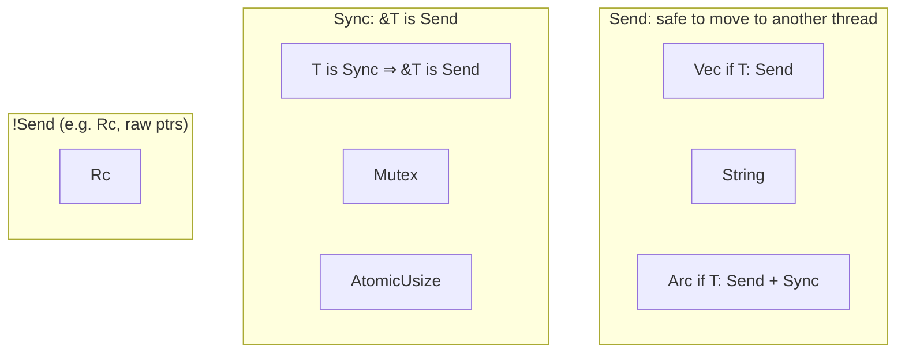
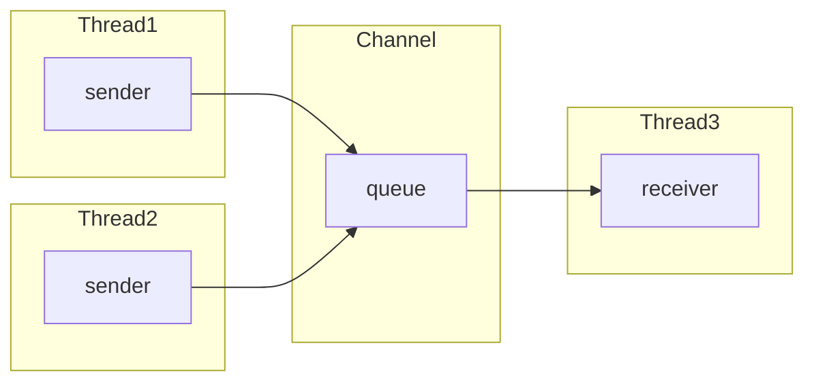
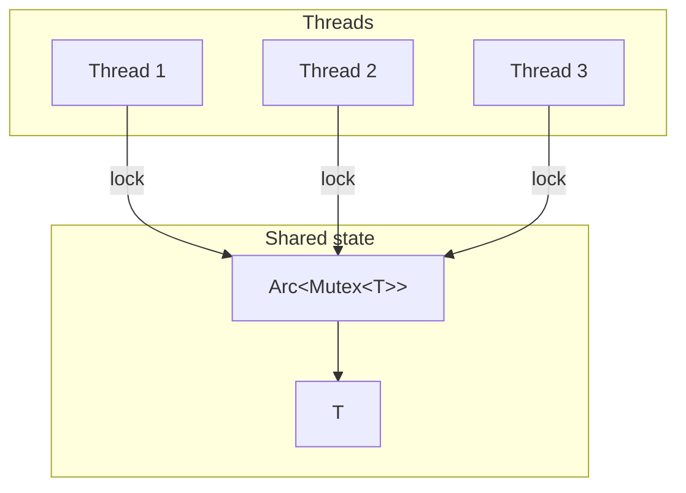
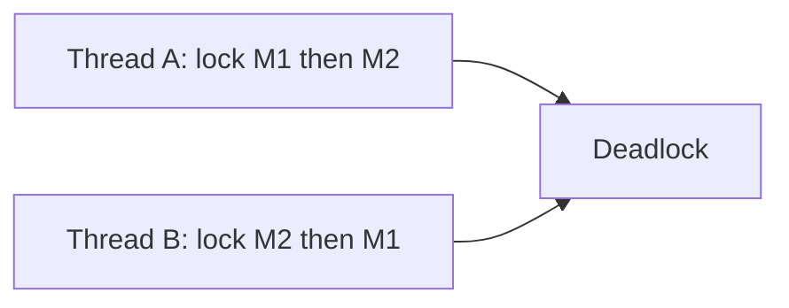

# Concurrency: Send, Sync, and Shared State

Rust’s type system enforces **safe concurrency**: data races are impossible in safe code. That’s done with the **Send** and **Sync** traits and careful use of locks and channels.

## Why This Matters

- **No data races in safe code** — the compiler guarantees either single ownership, shared read-only state, or synchronized mutation.
- **Send** — “this value can be transferred to another thread.”
- **Sync** — “references to this type can be shared across threads” (i.e. `&T` is `Send`).

Use concurrency when you need parallelism (multiple cores) or when different tasks (threads or async tasks) must coordinate. Use the right primitive (channels vs shared state) so the design stays clear and performant.

---

## Send and Sync at a Glance

- **Send** — “ownership of this value can be transferred across thread boundaries.” Most types are `Send`; exceptions include `Rc`, some raw pointers, and types that wrap them.
- **Sync** — “it’s safe to share `&T` across threads.” So `T: Sync` means “immutable access from multiple threads is OK.” `Mutex<T>`, `RwLock<T>`, and `Atomic*` are `Sync` because they synchronize mutation.

The compiler only lets you:
- **Move** a value to another thread if it’s `Send`.
- **Share** a reference across threads (e.g. in an `Arc`) if the inner type is `Sync` (or you wrap it in a lock).

---

## Channels: Moving Data Between Threads

Channels transfer **ownership** of messages. No shared mutable state; one or more senders, one or more receivers.

| Type | Use case |
|------|----------|
| **mpsc** (multi-producer, single-consumer) | Many senders, one receiver; e.g. work queue, event stream. |
| **oneshot** | Single message, request–response. |
| **broadcast** | One sender, many receivers; e.g. shutdown or config. |

**When to use:** When tasks produce values that other tasks consume. Prefer channels when the pattern is “send work/results” rather than “many workers hitting the same mutable structure.”

---

## Shared State: Mutex, RwLock, and Arc

When multiple threads need to **read or modify** the same data, you combine **ownership/sharing** with **synchronization**:

- **`Mutex<T>`** — exclusive access; one writer at a time. Use when reads and writes are both possible and you don’t need many concurrent readers.
- **`RwLock<T>`** — many readers or one writer. Use when reads dominate and you want more parallelism.
- **`Arc<T>`** — shared ownership across threads; `T` must be `Sync` (or be a lock). So typically `Arc<Mutex<T>>` or `Arc<RwLock<T>>`.

**When to use:** When the natural model is “several workers operating on the same structure” (e.g. shared cache, graph, or registry). Prefer **channels** when the natural model is “stream of messages” or “work queue.”

---

## Avoiding Deadlocks

- **Lock ordering** — always acquire locks in the same order (e.g. by address or by a fixed global order).
- **Short critical sections** — do minimal work inside the lock; don’t call unknown code (which might lock again).
- **Structured concurrency** — use scoped threads or task trees so that cancellation and shutdown are predictable.

---

## Async vs Thread Concurrency

| Aspect | Threads | Async (e.g. Tokio) |
|--------|---------|---------------------|
| **Unit of work** | OS thread | Task (future) |
| **Blocking** | Blocks one thread | Blocks one task; other tasks run |
| **Shared state** | `Arc<Mutex<T>>` | `Arc<Mutex<T>>` or `Arc<RwLock<T>>` (same types often work) |
| **Communication** | `mpsc`, etc. | Channels, or shared state |
| **When** | CPU-bound or blocking APIs | I/O-bound, many concurrent operations |

In our framework we use **Tokio** for the main async runtime; we avoid blocking it. Shared state (e.g. graph, journal) is designed so that we can use `Arc` and locks or channels as appropriate without data races.
