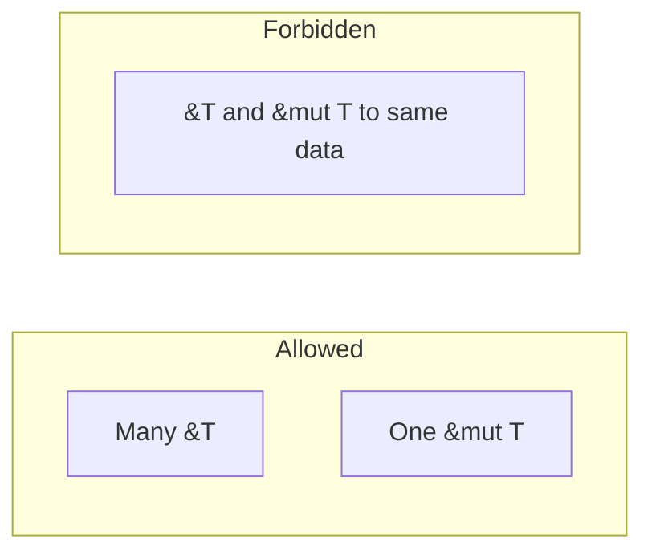
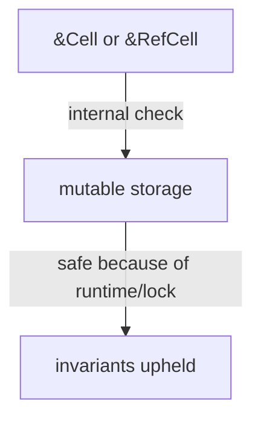
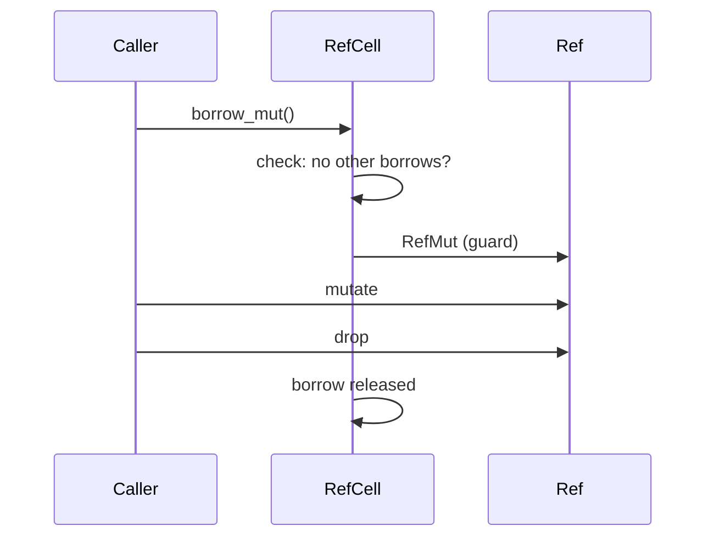
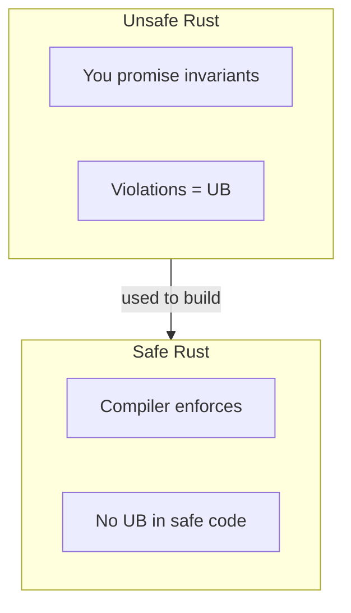

# Unsafe Rust and Interior Mutability

Rust’s default rules are “shared XOR mutable.” Some patterns need **interior mutability**: mutate through a shared reference. Others need **unsafe** to do things the compiler can’t prove (raw pointers, FFI, implementing core abstractions). Both are advanced and must be used carefully.

## Why This Matters

- **Interior mutability** — lets you have “logically immutable” APIs (e.g. `&self`) that still mutate caches, ref counts, or lazy state. Used in `RefCell`, `Mutex`, `RwLock`, and many library types.
- **Unsafe** — used to build the safe abstractions you use every day (e.g. `Vec`, `Rc`, `Mutex`, sync primitives). You use it when the compiler can’t verify correctness and you take responsibility for upholding invariants.

Use interior mutability when the *external* API is shared (`&self`) but internal state must change (caches, laziness, ref counts). Use unsafe only when necessary and keep it in small, well-audited modules with a clear safety contract.

---

## The Default Rule: Shared XOR Mutable

Normally Rust allows either:

- **Many** `&T` (shared, read-only), or  
- **One** `&mut T` (exclusive, read-write),

but not both at once.

Interior mutability and unsafe are the tools that allow controlled exceptions to this rule when the *implementation* guarantees no undefined behavior.

---

## Interior Mutability: Mutate Through &T

**Interior mutability** means a type allows mutation through a **shared reference** (`&T`) by enforcing invariants internally (e.g. with locks or single-thread checks).

| Type | Mechanism | When to use |
|------|-----------|-------------|
| **Cell&lt;T&gt;** | Copy or replace whole value; no references inside. | `T: Copy`, e.g. counters, flags. Single-thread only. |
| **RefCell&lt;T&gt;** | Runtime borrow check: multiple `Ref` (shared) or one `RefMut` (mutable). | Single-thread; need to mutate through `&self` (caches, graphs with back-edges). |
| **Mutex&lt;T&gt;** | Lock; only one holder at a time. | Multi-thread; shared mutable state. |
| **RwLock&lt;T&gt;** | Many readers or one writer. | Multi-thread; read-heavy shared state. |
| **Atomic* ** | Lock-free; single-word updates. | Counters, flags, simple state across threads. |

**Why it’s useful:** APIs like “get or insert in cache” or “lazy init” want to take `&self` but still mutate. Without interior mutability you’d have to pass `&mut self` everywhere or push mutation to the caller.

**When to use:** When you need to mutate through a shared reference and you’ve chosen the right primitive (single-thread vs multi-thread, lock-free vs lock). Don’t overuse: prefer “real” `&mut` when the API can expose it.

---

## RefCell in Practice

- **`borrow()`** — panics if a `RefMut` is active; returns a `Ref` (shared).
- **`borrow_mut()`** — panics if any `Ref` or `RefMut` is active; returns a `RefMut` (exclusive).

So the *runtime* enforces “no alias and mutate at once,” similar to the compiler’s rules, but for a single thread. Use `RefCell` when the compiler can’t see that your borrows don’t overlap (e.g. graph traversals, caches).

---

## Unsafe Rust: What It Is and Isn’t

**Unsafe** doesn’t mean “no checks.” It means “the compiler can’t prove safety; the programmer must uphold the **safety contract**.”

**The only things unsafe allows:**

1. Dereference raw pointers.
2. Call unsafe functions.
3. Implement unsafe traits (e.g. `Send`, `Sync`).
4. Access or modify mutable statics.
5. Access fields of unions.

Everything else (e.g. forgetting values, leaking) is allowed in safe Rust too; “unsafe” is not “dangerous in every way,” it’s “these operations can cause UB if misused.”

---

## When to Use Unsafe

- **Implementing core abstractions** — `Vec`, `Box`, `Rc`, `Arc`, `Mutex`, channels, etc.
- **FFI** — calling C or other languages.
- **Performance-critical code** — after measuring; e.g. safe alternatives to raw pointer tricks.
- **New concurrency primitives** — implementing `Send`/`Sync` or lock-free structures.

**Best practice:** Keep unsafe in a small layer; expose a **safe API** with a clear contract (“callers must ensure X”). Document the invariants and consider tests or proofs for the unsafe block.

---

## Relation to the Framework

- **Graph engine** — we use **indices** (slotmap, petgraph) instead of `Rc<RefCell<Node>>` to avoid interior mutability in the hot path and to keep the graph easy to reason about and serialize.
- **Durable context** — journal reads/writes could be wrapped in interior mutability if the API is `&self`; we keep the safety boundary clear.
- **Unsafe** — we rely on the standard library and well-known crates (Tokio, wasmtime, etc.) that already encapsulate unsafe; new unsafe in our code should be rare and justified.

Understanding interior mutability and unsafe helps you use `RefCell`/`Mutex` correctly and add minimal, well-scoped unsafe only when necessary.
