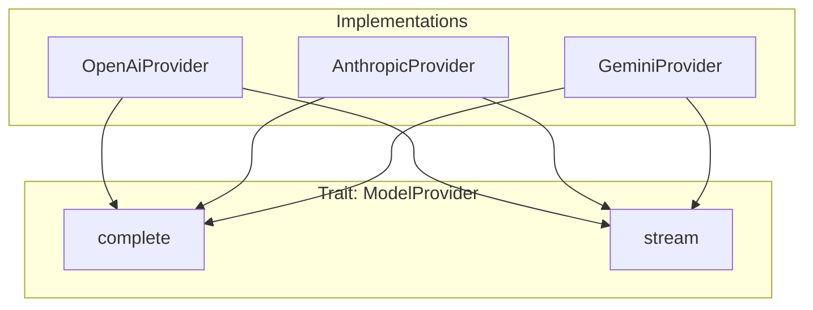
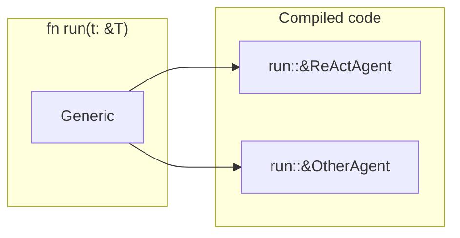
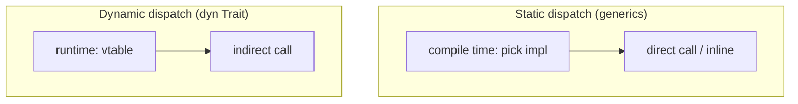
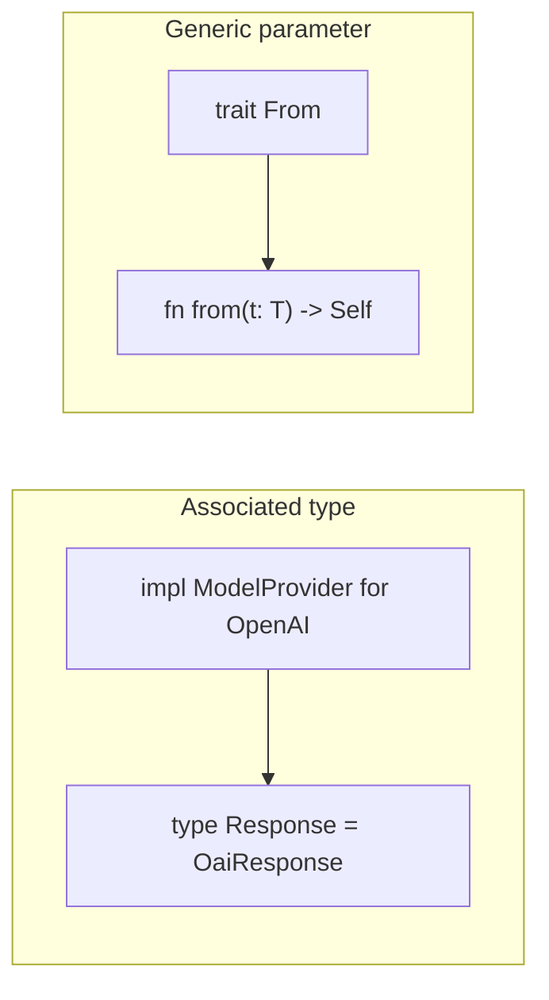

# Traits, Generics, and Zero-Cost Abstractions

Rust’s type system is built on **traits** and **generics**. They give you polymorphism and abstraction with **zero runtime cost**: the compiler monomorphizes generics and inlines trait methods. That’s why we can have a single `Agent` or `ModelProvider` interface without virtual call overhead in hot paths.

## Why This Matters

- **Traits** — shared behavior; “this type can do X.” Used for capabilities (e.g. `Agent`, `Workflow`, `Memory`, `Tool`).
- **Generics** — write one function or type over “any T that satisfies these bounds”; compiler generates specialized code per concrete type.
- **Zero-cost** — no vtable or heap allocation required for trait bounds on generics; you get static dispatch and inlining. When you need dynamic dispatch, you opt in with `dyn Trait`.

Use traits + generics for libraries and frameworks (one implementation, many types). Use `dyn Trait` when the set of types isn’t known at compile time or you need to reduce code size.

---

## Traits: Contracts for Types

A trait is a set of methods (and possibly associated types/constants) that types can implement.

- **Why useful:** Same interface for many backends (OpenAI, Anthropic, Gemini); callers don’t depend on concrete types.
- **When to use:** Whenever multiple types should satisfy the same contract (serialization, comparison, execution, etc.).

---

## Generics: One Definition, Many Types

Generic functions and types are parameterized by type (and lifetimes, constants). The compiler **monomorphizes** them: it generates a separate version for each concrete type used.

- **Static dispatch** — the exact type is known at compile time; the right implementation is inlined. No vtable, no indirection.
- **Zero-cost** — you write one generic function; you pay only for the concrete types you use, with no extra runtime abstraction cost.

**When to use:** In libraries and framework code (e.g. “run any `T: Agent`”, “any `M: Memory`”). Prefer generics when the set of types is finite and known at compile time.

---

## Static vs Dynamic Dispatch

| | Static (generics) | Dynamic (`dyn Trait`) |
|---|-------------------|------------------------|
| **Resolution** | Compile time | Runtime (vtable) |
| **Cost** | Inline / direct call | Pointer indirection |
| **When** | Types known at compile time | Heterogeneous collection, plugins, config-driven |
| **Code size** | One copy per concrete type | One shared implementation |

In our framework we use **generics** where we can (e.g. `run_agent(&agent, input)` with `impl Agent`) and **`dyn ModelProvider`** or **`Arc<dyn ToolExecutor>`** where we need to hold different implementations in the same type (e.g. registry, config).

---

## Key Trait Bounds

| Bound | Meaning | Use |
|-------|---------|-----|
| **T: Send** | T can be moved across threads | Required when sending to another thread or storing in a multi-threaded context. |
| **T: Sync** | `&T` can be shared across threads | Required for `Arc<T>`, shared state. |
| **T: Clone** | T can be duplicated | When you need a copy without taking ownership. |
| **T: ?Sized** | T may be unsized (e.g. `dyn Trait`, `[u8]`) | When you want to allow dynamically sized types. |

---

## Associated Types vs Generic Parameters

Traits can have **associated types** (one type per impl) or **generic parameters** (caller chooses type per use).

- **Associated type** — “this trait has one output (or input) type per implementor.” E.g. `Iterator::Item`. Use when there’s a single “natural” type per impl.
- **Generic parameter** — “caller or impl can choose a type.” E.g. `From<T>`. Use when the same type might implement the trait for many different T.

---

## Why This Is “Advanced”

- **Trait objects** (`dyn Trait`) — object safety, sizing, and when to use vs generics.
- **Blanket impls** — “impl Trait for all T that satisfy X” (e.g. `impl<T: Display> ToString for T`).
- **Higher-ranked trait bounds** — e.g. for closures and async: `for<'a> T: Fn(&'a str)`.
- **Newtype and orphan rules** — where you can implement which traits for which types.

Mastering traits and generics lets you design APIs that are both flexible and zero-cost, which is central to Rust’s use in frameworks and performance-sensitive code like our agent runtime.
